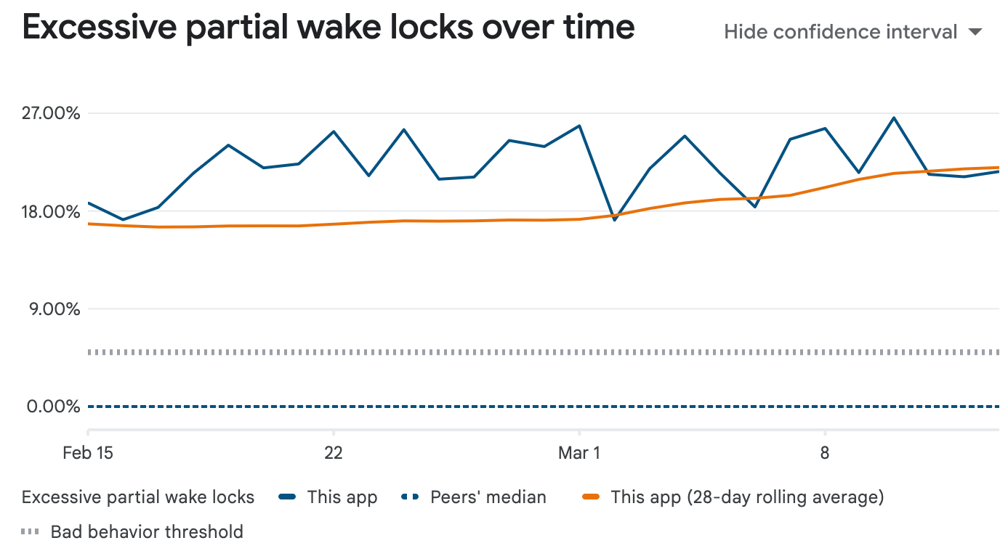
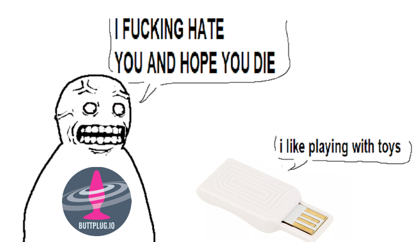

It's that time again. We're releasing Intiface Central 3.0.3. This is an exciting release with a lot of bug fixes. Not so much in the way a new features this time around, but this'll give us a good basis to build out on, or at least hopefully stop people from yelling at us so much.

[You can get it via the Intiface Central front page.](https://intiface.com)

<!-- truncate -->

## Android Changes 

There’s been a lot of updates to the android system in this release, including the Bluetooth system as well as handling keepalives a little bit better. 

On the Bluetooth side, there were just a lot of errors we weren’t throwing, which would cause users to crash when starting and stopping Bluetooth scan. These have been by far the most common crashes we see in our crash logging system for all platforms, since the mobile app was first released. With the changes made this version, we hope these bugs have been resolved, or at least that we'll have a better chance of figuring out how to resolve them versus just falling over. This includes building a full hardware platform for testing our bluetooth library, which has already surfaced several bugs we didn't even know we had. 

We’ve been getting a lot of complaints from both users and the Google play store that the app keeps the phone alive for too long and therefore drains power. The only time this really needs to happen is with certain devices that require updates every few seconds to stay on (brands like Satisfyer, VibCrafter, Mysteryvibe, etc). We've done some work to make sure we only stay on when needed, which should hopefully reduce power draw on phones.
## Deprecating Lovense Connect and the Lovense Dongle

The next Intiface Central will have *less* features (I can hear every other software dev out there sighing happily). We are deprecating support for the Lovense USB Dongle, as well as the Lovense Connect Service. Support still exists in v3.0.3 of Intiface Central, but will be removed in v3.1.0 (the next non-bug-fix version).

Both of these services were added when Buttplug and Intiface were in their early stages, and we did not have a mobile application. That’s no longer the case, so while they're still used (mostly due to habit and our lack of documentation and guidance), these services really just produced bugs more than anything. 

We’ve gotten in tons of reports that Lovense Connect no longer works post Intiface v3. We're not sure whether we broke it or Lovense changed it, and frankly, we don’t care. Neither Connect nor the dongle were documented by Lovense or meant for use by 3rd parties, we reverse engineered them as best we could with the time/resources we had. Maintenance is a nightmare, and we don’t want to do it anymore. 

We’re replacing Lovense Connect with using the Interface Central mobile app in a couple of different ways, with [starting documentation already available in the Intiface Docs](https://intiface.com/docs/intiface-central/brands/lovense).

For the Lovense Dongle, the recommendation to is to use a regular Bluetooth dongle. Windows 10 and 11 both have decent Bluetooth capabilities at this point, and a regular bluetooth dongle is far faster and more reliable than the Lovense dongle. [Guidance on which Bluetooth Dongles we recommend are available in the Intiface Documentation](https://intiface.com/docs/intiface-central/hardware/bluetooth).

We're happy to help users through this transition where we can through our [various support channels](https://buttplug.io/docs/dev-guide/intro/getting-help).
## TCode Fixes and Device Additions

We're aware that users of TCode devices have had issues with the device not registering with video sync services lately. This was due to a device misconfiguration in a prior version of Intiface Central, which has been fixed in this version of Intiface.

**IMPORTANT NOTE**: To fix this properly, you may need to hit "forget device" in the Intiface Central devices tab and readd the device using the serial port dialog.

For anyone using TCode devices in real time situations (VRChat + OSCGB, etc), please get in touch with us [via our support channels](https://buttplug.io/docs/dev-guide/intro/getting-help), as we're looking at how to support those users better.

 Finally, we’ve got some device additions. We’ve added support for HoneyPlayBox devices as well as more Joyhub devices. WeVibe devices now have battery reading support.

## What's Next

With what is hopefully a more stable base to work on top of, what's next?

_**JFC. THE DEVICE PANEL. IT'S SO BAD.**_

The Device Panel of Intiface Central is possibly the most important part of the UI, but also the least worked on because it's a complicated mess. We're looking forward to scrubbing and rebuilding it, with some new features:
- Support for device property changes while clients are connected or the server is on, so you can tune limits while using things instead of having to constantly stop and restart
- Ability to see the current state of a device, such as how fast it's vibrating or where in a stroking event it is (I cannot believe we don't have this yet)
- Simulated devices so poor devs don't have to put a toy on their desk every time they want to do something.

No ETA on when this will be out, but it’s our hope that this is going to be in the next minor version update. 

As always if you have any issues with the software, please do not hesitate to reach out via our [support channels](https://buttplug.io/docs/dev-guide/intro/getting-help).

Until next time, keep buttpluggin'!