# Architecture

## Goals

The goals of the Buttplug Protocol are fairly simple:

- Relay information about device connections and disconnects from the Buttplug server to client
  applications.
- Allow developers to know what features a device presents.
- Allow developers to access those features in a uniform manner.

This goals guide how new messages are added to the protocol, and established messages are changed between versions as developers give us feedback on their specific usages.

## Structures

Buttplug define systems it is used in via a few different structures:

- _Device_
  - In Buttplug terms, a _Device_ is a set of _Features_. Each feature can have the following
    attributes:
    - _Actuators_: Device outputs like vibration, stroking, etc...
    - _Sensors_: Device inputs like buttons, pressure gauges, accelerometers/IMUs, etc...
    - _Raw_: A special attribute used for direct device communication without Buttplug as a protocol
      translation intermediary. _Raw_ attributes are rarely seen, mostly in the context of developer
      debugging or special requirements for DIY devices.
  - A device may not always directly represent a piece of hardware. For instance, a device may be
    simulated as part of a developer tool, or act as an intermediary for network access to a remote
    controller. This distinction matters at the server level, but is usually hidden from clients.
- _Server_
  - The portion of the system that handles direct device communication. The Buttplug Server handles
    connections from clients, as well as translating messages from the client into corresponding proprietary commands for devices.
  - Servers are by far the most complicated portion of a Buttplug system, and are expected to be
    rarely implemented outside of the [reference
    implementation](https://github.com/buttplugio/buttplug).
- _Client_
  - An application that integrates a Buttplug Client library or API. These applications (which can
    be games, music players, movie players, other development tools, etc) use a Buttplug Client
    library written in a matching programming language/environment to connect to the Buttplug
    _Server_ and allows developers to gather information about toys and control them in a way that
    *should* abstract them from the raw Buttplug Protocol that is presented in this document.
  - Clients will need to be implemented for various programming languages and environments like game
    engines. A list of those currently available can be found as part of the [Buttplug Awesome List](https://github.com/buttplugio/awesome-buttplug?tab=readme-ov-file#development-and-libraries).
  - If you are writing a Buttplug implementation library and expecting your user to create Buttplug
    Messages themselves, you are _most likely making life more difficult on your users_. If that is
    your goal, then that is fine, but otherwise more guidance on client creation is given in the
    [Buttplug Developer Guide](/docs/dev-guide).

Note that the use of _Client_ and _Server_ here does not explicitly denote network connection. These
terms are used as a generic way to denote different communication endpoints. Clients and Servers may both be embedded in the same process, or may talk over methods such as network or some form of IPC.

## Protocol

The Buttplug Protocol defines a message based protocol between a _Client_ and a _Server_.

Client are expected to request information from the server about devices that are connected, and to
send information to those devices via the server. Servers will handle device enumeration, connection
management to hardware, and failure recoveries (for instance, stopping all connected devices on
client disconnect).

Buttplug uses JSON for serialization in most situations, but this is not a hard rule. Any serialization standard could work depending on context.

## Stages

Buttplug sessions between the _Client_ and _Server_ consist of 3 stages. While these stages need not
be discrete, due to the way Buttplug will likely be used, they will usually end up being so.
_Client_ implementations may hide or combine some of the stages depending on requirements.

### Identification

During the identification stage, a _Client_ will establish connection with the _Server_, and send
over identifying information. The _Server_ may trigger some sort of UI event at this point to ask if
the user will allow the client to connect and interact.

### Enumeration

After the _Client_/_Server_ connection is set up, device enumeration can begin. The _Client_ can ask
the _Server_ for a list of currently connected devices. It can also request the server scan for
devices on various busses or media (serial, usb, bluetooth, network, etc), and return a list of
devices it has found.

### Consummation

Once devices are found and selected, we can assume the user will begin interacting with connected
devices via the _Client_. At this point, the _Client_ will mostly be sending and receiving device
commands. There may also be more enumeration during usage, as devices can disconnect and will need
to reconnect.

### Example lifecycle

The following lifecycle covers the general message flow expected between a Buttplug _Client_ and a
Buttplug _Server_.

```mermaid
sequenceDiagram
  Participant Client
  Participant Server

  Note over Client,Server: Once a connection is established,<br/> perform the protocol handshake,<br/>which exchanges information<br/>about identification, versions,<br/>ping times, etc...
  Client->>+Server: RequestServerInfo Id=1
  Server->>-Client: ServerInfo Id=1

  Note over Client,Server: If the server has a non-zero<br/>PingTimeout, the client must send<br/>a ping message to theserver<br/>before the specified timeout.<br/>A common strategy is to set<br/>the client Ping time to 1/2 the<br/>requested server ping time.
  loop [PingTime/2]
    Client->>+Server: Ping ID=N++
    Server->>-Client: Ok ID=N++
  end

  Note over Client,Server: The client calls RequestDeviceList<br/>to get a list of already connected<br/>devices.
  Client->>+Server: RequestDeviceList Id=2
  Server->>-Client: DeviceList Id=2
  
  Note over Client,Server: To discover new devices, the client<br/>instructs the server to start<br/>scanning.
  Client->>+Server: StartScanning Id=3
  Server->>-Client: Ok Id=3
  
  Note over Client,Server: While the server is scanning, the<br/>server will notify the client of new<br/>devices.
  Server->>Client: DeviceList Id=0
  Server->>Client: DeviceList Id=0
  
  Note over Client,Server: Once devices have been discovered,<br/> the client instruct the server to<br/> stop scanning. Once all device<br/>managers have stopped scanning,<br/>the server will notify the client.
  Client->>+Server: StopScanning Id=4
  Server->>-Client: Ok Id=4
  
  Note over Client,Server: Devices may disconnect at any time.<br/>The server will notify the client<br/>when this happens.
  Server->>Client: DeviceList Id=0
  
  Note over Client,Server: The client may instruct devices to<br/>perform actions. Actions vary per<br/>device. Device capabilities are<br/>relayed as part of DeviceList messages.
  Client->>+Server: ValueCmd Id=5
  Server->>-Client: Ok Id=5
  
  Note over Client,Server: The client may instruct the server to<br/>stop a device from whatever it<br/>may be doing.
  Client->>+Server: StopDeviceCmd Id=6
  Server->>-Client: Ok Id=6
  
  Note over Client,Server: The client may instruct the server to<br/>stop all devices. This is considered<br/> good form for a client that is<br/>shutting down.
  Client->>+Server: StopAllDevices Id=7
  Server->>-Client: Ok Id=7
```

