# Deprecated Messages

The following messages are considered deprecated, either because they've been duplicated by new
messages, or because their message version has changed and they represent an old version of a
message.

While some older versions of messages are not required to be implemented unless a server wants to
support version fallback, other messages, such as deprecated device commands, should most likely be
implemented in all servers. Any reference servers provided by the Buttplug Core Team will support
all messages, even those that have been deprecated.

---
## DeviceList - Spec V0

**Reason for Deprecation:** Superceded by [DeviceList Version 1](enumeration#devicelist), which
provides more information about feature limits of generic messages.

**Description:** Server reply to a client request for a device list.

**Introduced In Spec Version:** 0

**Fields:**

* _Id_ (unsigned int): Message Id
* _Devices_ (array): Array of device objects
  * _DeviceName_ (string): Descriptive name of the device
  * _DeviceIndex_ (unsigned integer): Index used to identify the device when sending Device
    Messages.
  * _DeviceMessages_ (array of strings): Type names of Device Messages that the device will accept.

**Expected Response:**

None. Server-to-Client message only.

**Flow Diagram:**

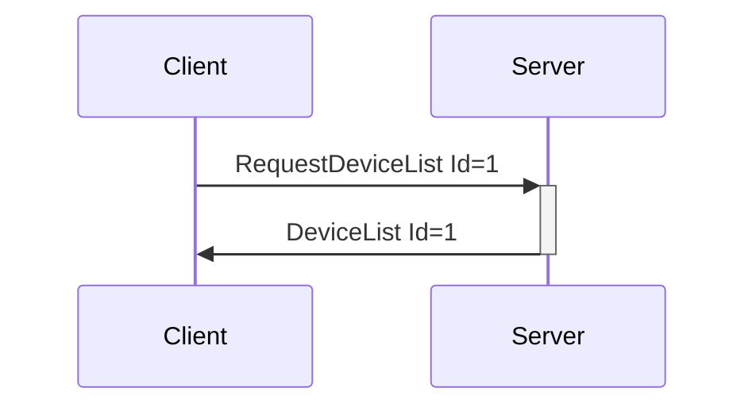

**Serialization Example:**

```json
[
  {
    "DeviceList": {
      "Id": 1,
      "Devices": [
        {
          "DeviceName": "TestDevice 1",
          "DeviceIndex": 0,
          "DeviceMessages": ["SingleMotorVibrateCmd", "RawCmd", "KiirooCmd", "StopDeviceCmd"]
        },
        {
          "DeviceName": "TestDevice 2",
          "DeviceIndex": 1,
          "DeviceMessages": ["SingleMotorVibrateCmd", "LovenseCmd", "StopDeviceCmd"]
        }
      ]
    }
  }
]
```
---
## DeviceAdded - Spec V0

**Reason for Deprecation:** Superceded by [DeviceList Version 1](enumeration#devicelist), which
provides more information about feature limits of generic messages.

**Introduced In Spec Version:** 0

**Fields:**

* _Id_ (unsigned int): Message Id
* _DeviceName_ (string): Descriptive name of the device
* _DeviceIndex_ (unsigned integer): Index used to identify the device when sending Device Messages.
* _DeviceMessages_ (array of strings): Type names of Device Messages that the device will accept.

**Expected Response:**

None. Server-to-Client message only.

**Flow Diagram:**

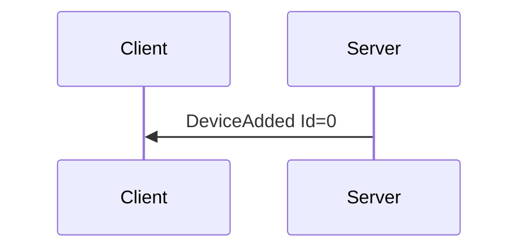

**Serialization Example:**

```json
[
  {
    "DeviceAdded": {
      "Id": 0,
      "DeviceName": "TestDevice 1",
      "DeviceIndex": 0,
      "DeviceMessages": ["SingleMotorVibrateCmd", "RawCmd", "KiirooCmd", "StopDeviceCmd"]
    }
  }
]
```
---
## DeviceList - Spec V1

**Reason for Deprecation:** Superceded by [DeviceList Version 3](enumeration#devicelist), which
provides optional display name and message timing information, as well as simplifies the format of message attributes.

**Description:** Server reply to a client request for a device list.

**Introduced In Spec Version:** 0

**Last Updated In Spec Version:** 1 (See [Deprecated
Messages](deprecated.md#devicelist---version-0) for older versions.)

**Fields:**

* _Id_ (unsigned int): Message Id
* _Devices_ (array): Array of device objects
  * _DeviceName_ (string): Descriptive name of the device
  * _DeviceIndex_ (unsigned integer): Index used to identify the device when sending Device Messages.
  * _DeviceMessages_ (dictionary): Accepted Device Messages 
    * Keys (string): Type names of Device Messages that the device will accept
    * Values ([Message
      Attributes](enumeration.md#message-attributes-for-devicelist-and-deviceadded)):
      Attributes for the Device Messages.

**Expected Response:**

None. Server-to-Client message only.

**Flow Diagram:**


**Serialization Example:**

```json
[
  {
    "DeviceList": {
      "Id": 1,
      "Devices": [
        {
          "DeviceName": "TestDevice 1",
          "DeviceIndex": 0,
          "DeviceMessages": {
            "VibrateCmd": { "FeatureCount": 2 },
            "StopDeviceCmd": {}
          }
        },
        {
          "DeviceName": "TestDevice 2",
          "DeviceIndex": 1,
          "DeviceMessages": {
            "LinearCmd": { "FeatureCount": 1 },
            "StopDeviceCmd": {}
          }
        }
      ]
    }
  }
]
```
---
## DeviceAdded - Spec V1

**Reason for Deprecation:** Superceded by [DeviceAdded Version 3](enumeration#deviceadded), which
provides more information about feature limits of generic messages, as well as simplifies the format of message attributes.

**Description:** Sent by the server whenever a device is added to the
system. Can happen at any time after identification, as it is assumed
many server implementations will support devices with hotplugging
capabilities that do not require specific scanning/discovery sessions.

**Introduced In Spec Version:** 0

**Last Updated In Spec Version**: 1 (See [Deprecated
Messages](deprecated.md#deviceadded---version-0) for older versions.)

**Fields:**

* _Id_ (unsigned int): Message Id
* _DeviceName_ (string): Descriptive name of the device
* _DeviceIndex_ (unsigned integer): Index used to identify the device
  when sending Device Messages.
* _DeviceMessages_ (dictionary): Accepted Device Messages 
  * Keys (string): Type names of Device Messages that the device will accept
  * Values ([Message
    Attributes](enumeration.md#message-attributes-for-devicelist-and-deviceadded)):
    Attributes for the Device Messages.

**Expected Response:**

None. Server-to-Client message only.

**Flow Diagram:**


**Serialization Example:**

```json
[
  {
    "DeviceAdded": {
      "Id": 0,
      "DeviceName": "TestDevice 1",
      "DeviceIndex": 0,
      "DeviceMessages": {
        "VibrateCmd": { "FeatureCount": 2 },
        "StopDeviceCmd": {}
      }
    }
  }
]
```
---

## Message Attributes - Spec V2

**Reason for Deprecation:** Superceded by Message Attributes Version 3, changing format to be one
message attributes object per device feature, and adding sensor/actuator types, feature descriptors,
etc...

**Introduced In Spec Version:** 1

**Last Updated In Spec Version**: 2

**Description:** A collection of message attributes. This object is always the child of a Device
Message type name within a [DeviceList](enumeration.md#devicelist) or
[DeviceAdded](enumeration.md#deviceadded) message. Not all attributes are relevant for all Device
Messages on all Devices; in these cases the attributes will not be included.

**Attributes:**

* _FeatureCount_ (unsigned int): Number of features the Device Message may address. This attribute
  is used to define the capabilities of generic device control messages. The meaning of "feature" is
  specific to the context of the message the attribute is attached to. For instance, the
  FeatureCount attribute of a VibrateCmd message will refer to the number of vibration motors that
  can be controlled on a device advertising the VibrateCmd message.
* _StepCount_ (array of unsigned int, minimum value: 1): For each feature, lists the number of
  discrete steps the feature can use. Returning to the VibrateCmd example from the above
  _FeatureCount_ specification, if a device had 2 motors, and each motor has 20 steps of vibration
  speeds from 0%-100% (this is exactly what the Lovense Edge is), the _StepCount_ attribute would be
  [20, 20]. Having the array allows use to specify different amounts of steps for multiple vibrators
  on the device.

---
## Message Attributes - Spec V1

**Reason for Deprecation:** Superceded by Message Attributes Version 2, adding step count.

**Introduced In Spec Version:** 0

**Last Updated In Spec Version**: 2

**Description:** A collection of message attributes. This object is always the child of a Device
Message type name within a [DeviceList](enumeration.md#devicelist) or
[DeviceAdded](enumeration.md#deviceadded) message. Not all attributes are relevant for all Device
Messages on all Devices; in these cases the attributes will not be included.

**Attributes:**

* _FeatureCount_ (unsigned int): Number of features the Device Message may address. This attribute
  is used to define the capabilities of generic device control messages. The meaning of "feature" is
  specific to the context of the message the attribute is attached to. For instance, the
  FeatureCount attribute of a VibrateCmd message will refer to the number of vibration motors that
  can be controlled on a device advertising the VibrateCmd message.

---
## RequestServerInfo - Spec V0

**Reason for Deprecation:** Superceded by [RequestServerInfo Version
1](identification.md#requestserverinfo), adding message version check.

**Description:** Sent by the client to register itself with the server, and request info from the server.

**Spec Version:** 0

**Fields:**

* _Id_ (unsigned int): Message Id
* _ClientName_ (string): Name of the client, for the server to use for UI if needed. Cannot be null.

**Expected Response:**

* ServerInfo message on success
* Error message on malformed message, null client name, or other error.

**Flow Diagram:**

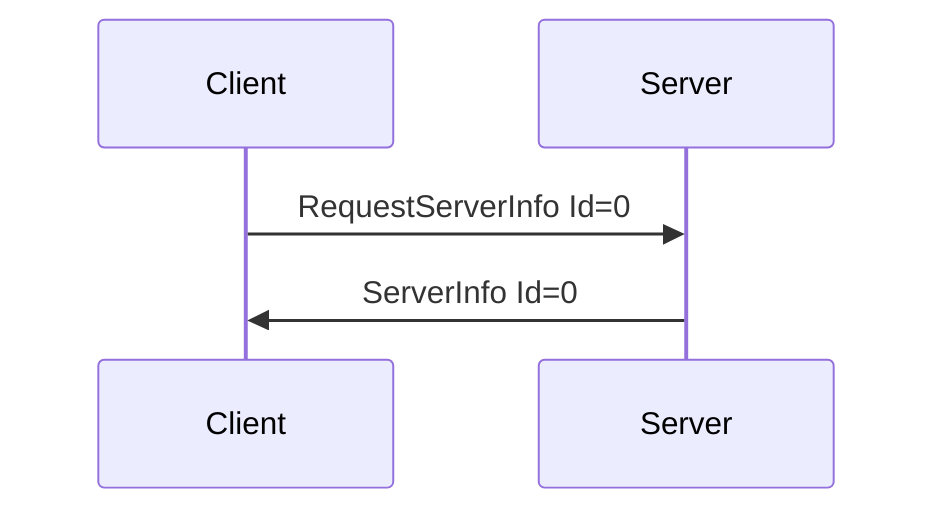

**Serialization Example:**

```json
[
  {
    "RequestServerInfo": {
      "Id": 1,
      "ClientName": "Test Client"
    }
  }
]
```
---
## ServerInfo - Spec V0

**Reason for Deprecation:** Superceded by [ServerInfo Version 1](identification.md#serverinfo),
removing unused version info.

**Description:** Send by server to client, contains information about the server name \(optional\),
template version, and ping time expectations.

**Introduced In Spec Version:** 0

**Fields:**

* _Id_ \(unsigned int\): Message Id
* _ServerName_ \(string\): Name of the server. Can be null \(0-length\).
* _MajorVersion_ \(uint\): Major version of the server software.
* _MinorVersion_ \(uint\): Minor version of the server software.
* _BuildVersion_ \(uint\): Build version of the server software.
* _MessageVersion_ \(uint\): Message template version of the server software.
* _MaxPingTime_ \(uint\): Maximum internal for pings from the client, in milliseconds. If a client
  takes to longer than this time between sending Ping messages, the server is expected to
  disconnect.

**Expected Response:**

None. Server-To-Client message only.

**Flow Diagram:**


**Serialization Example:**

```json
[
  {
    "ServerInfo": {
      "Id": 1,
      "ServerName": "Test Server",
      "MajorVersion": 1,
      "MinorVersion": 0,
      "BuildVersion": 0,
      "MessageVersion": 1,
      "MaxPingTime": 100
    }
  }
]
```
---
## RawCmd

**Reason for Deprecation:** Message is ill-defined (doesn't specify where the data should go,
assumes all devices have one endpoint which is very not true), was never actually implemented in any
reference implemenation. Being superceded by Raw\*Cmd. As the message was never in any
protocol implementation, it can safely be ignored when implementing new servers, but should also not
be used to name new messages.

**Description:** Used to send a raw byte string to a device. Should only be used for development,
and should not be exposed to untrusted clients.

**Introduced In Spec Version:** 0

**Last Updated In Spec Version:** 0

**Fields:**

* _Id_ (unsigned int): Message Id
* _DeviceIndex_ (unsigned int): Index of device
* _Command_ (Array of bytes): Command to send, array of ints with a range of [0-255]. Minimum length
  is 1.

**Expected Response:**

* Ok message with matching Id on successful request.
* Error message on value or message error.

**Flow Diagram:**

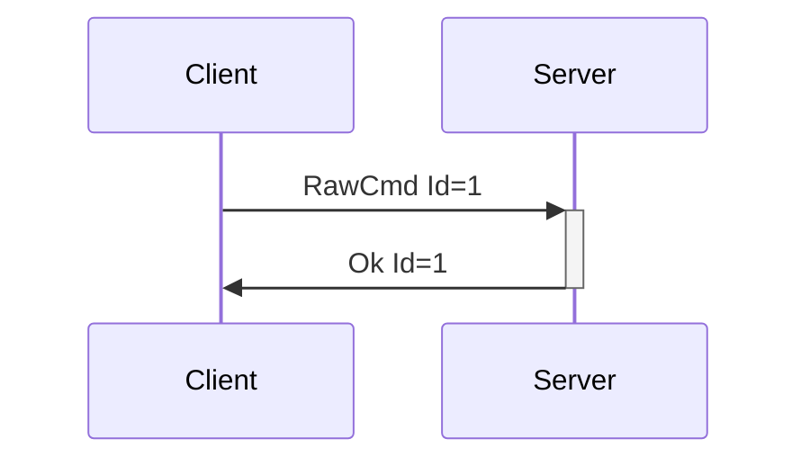

**Serialization Example:**

```json
[
  {
    "RawCmd": {
      "Id": 1,
      "DeviceIndex": 0,
      "Command": [0, 2, 4]
    }
  }
]
```
---
## SingleMotorVibrateCmd

**Reason for Deprecation:** Superceded by [VibrateCmd](deprecated.md#vibratecmd), which provided
granular control of an unlimited number of motors. Should most likely still be implemented in
servers, in order to support older applications, but is not recommended for use in new client
applications.

**Description:** Causes a device that supports vibration to run all vibration motors at a certain
speed.

**Introduced In Spec Version:** 0

**Fields:**

* _Id_ (unsigned int): Message Id
* _DeviceIndex_ (unsigned int): Index of device
* _Speed_ (double): Vibration speed with a range of [0.0-1.0]

**Expected Response:**

* Ok message with matching Id on successful request.
* Error message on value or message error.

**Flow Diagram:**

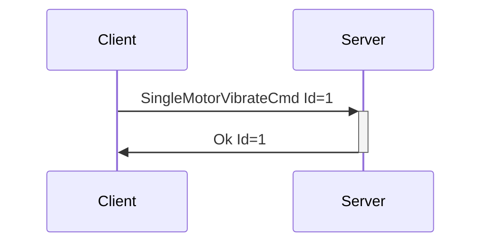

**Serialization Example:**

```json
[
  {
    "SingleMotorVibrateCmd": {
      "Id": 1,
      "DeviceIndex": 0,
      "Speed": 0.5
    }
  }
]
```
---
## KiirooCmd

**Reason for Deprecation:** Only implemented in early versions of the C# library, did not cover
nearly enough of the vast spectrum of possible commands for Kiiroo devices. Replaced by... pretty
much everything generic.

**Description:** Causes a device that supports Kiiroo style commands to run whatever event may be
related. More information on Kiiroo commands can be found in STPIHKAL.

**Introduced In Spec Version:** 0

**Last Updated In Spec Version:** 0

**Fields:**

* _Id_ (unsigned int): Message Id
* _DeviceIndex_ (unsigned int): Index of device
* _Command_ (string): Parsed into an unsigned integer in range [0-4] for position/speed.

**Expected Response:**

* Ok message with matching Id on successful request.
* Error message on value or message error.

**Flow Diagram:**

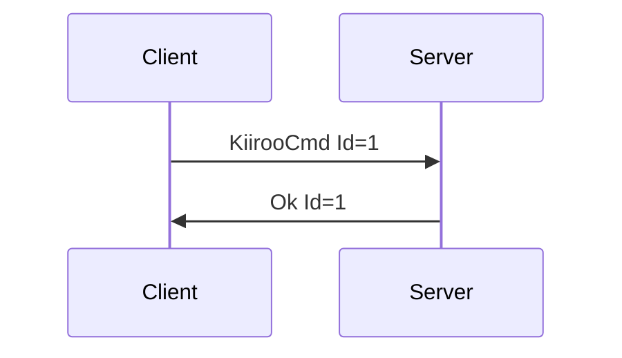

**Serialization Example:**

```json
[
  {
    "KiirooCmd": {
      "Id": 1,
      "DeviceIndex": 0,
      "Command": "4"
    }
  }
]
```
---
## FleshlightLaunchFW12Cmd

**Reason for Deprecation:** Superceded by [LinearCmd](deprecated.md#linearcmd), which provided an
easier way to reason about movement time and position.

**Description:** Causes a device that supports Fleshlight Launch (Firmware Version 1.2) style
commands to run whatever event may be related. More information on Fleshlight Launch commands can be
found in STPIHKAL.

**Introduced In Spec Version:** 0

**Last Updated In Spec Version:** 0

**Fields:**

* _Id_ (unsigned int): Message Id
* _DeviceIndex_ (unsigned int): Index of device
* _Position_ (unsigned int): Unsigned integer in range [0-99], denoting position to move to.
* _Speed_ (unsigned int): Unsigned integer in range [0-99], denoting speed to requested position at.

**Expected Response:**

* Ok message with matching Id on successful request.
* Error message on value or message error.

**Flow Diagram:**

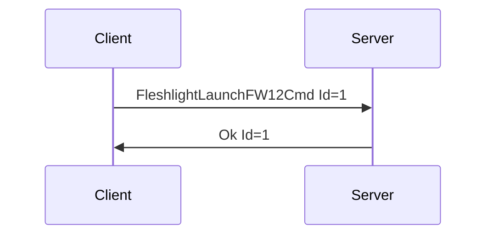

**Serialization Example:**

```json
[
  {
    "FleshlightLaunchFW12Cmd": {
      "Id": 1,
      "DeviceIndex": 0,
      "Position": 95,
      "Speed": 90
    }
  }
]
```
---
## LovenseCmd

**Reason for Deprecation:** Never implemented in any reference version of the library. Superceded by
a combination of [ScalarCmd](deprecated.md#scalarcmd), [RotateCmd](deprecated.md#rotatecmd),
[BatteryCmd](deprecated.md#batterycmd), and the [Raw*Cmd](deprecated.md#rawreadcmd) commands.

**Description:** Causes a device that supports Lovense style commands to run whatever event may be
related. More information on Lovense commands can be found in STPIHKAL.

**Introduced In Spec Version:** 0

**Last Updated In Spec Version:** 0

**Fields:**

* _Id_ (unsigned int): Message Id
* _DeviceIndex_ (unsigned int): Index of device
* _Command_ (string): String command for Lovense devices. Must be a valid Lovense command accessible
  on most of their devices. See STPIHKAL for more info. Implementations should check this for
  validity.

**Expected Response:**

* Ok message with matching Id on successful request.
* Error message on value or message error.

**Flow Diagram:**

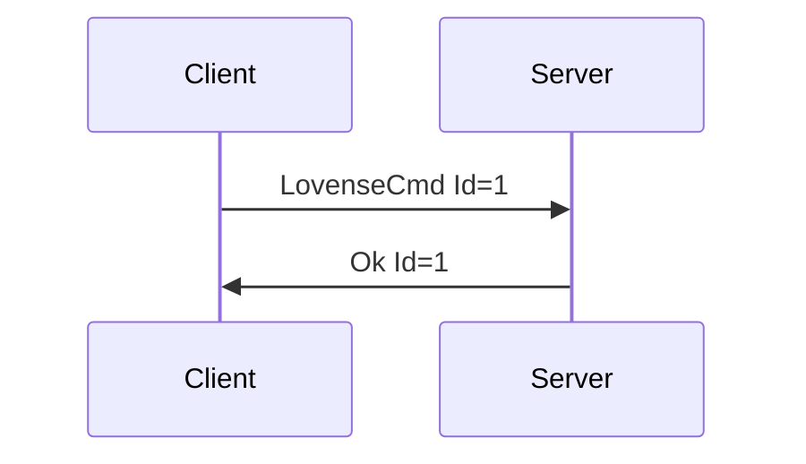

**Serialization Example:**

```json
[
  {
    "LovenseCmd": {
      "Id": 1,
      "DeviceIndex": 0,
      "Command": "Vibrate:20;"
    }
  }
]
```
---
## VorzeA10CycloneCmd

**Reason for Deprecation:** Superceded by a combination of [VibrateCmd](deprecated.md#linearcmd) and
[RotateCmd](deprecated.md#rotatecmd).

**Description:** Causes a device that supports Vorze A10 Cyclone style commands to run whatever
event may be related. More information on Vorze commands can be found in STPIHKAL.

**Introduced In Spec Version:** 0

**Last Updated In Spec Version:** 0

**Fields:**

* _Id_ (unsigned int): Message Id
* _DeviceIndex_ (unsigned int): Index of device
* _Speed_ (unsigned int): Unsigned integer in range [0-100], denoting speed to rotate at.
* _Clockwise_ (boolean): Rotation direction

**Expected Response:**

* Ok message with matching Id on successful request.
* Error message on value or message error.

**Flow Diagram:**

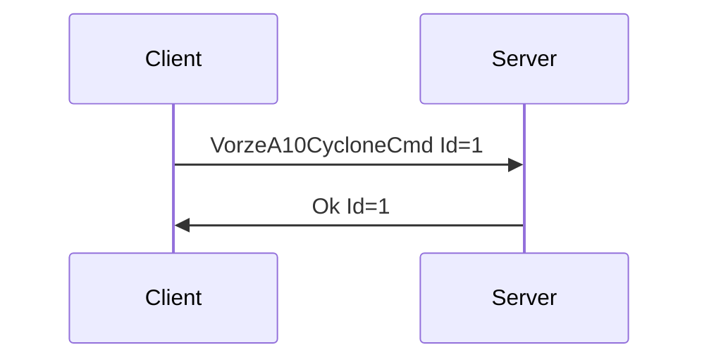

**Serialization Example:**

```json
[
  {
    "VorzeA10CycloneCmd": {
      "Id": 1,
      "DeviceIndex": 0,
      "Speed": 50,
      "Clockwise": true
    }
  }
]
```
---
## Test

**Reason for Deprecation:** Violates the assumption that server and client should not be able to
send the same message type. Not particularly useful either, since the whole protocol is made up of
messages, so if you've send/received one, you're... pretty much good.

**Description:** The Test message is used for development and testing purposes. Sending a Test
message with a string to the server will cause the server to return a Test message. If the string is
"Error", the server will return an error message instead.

**Introduced In Spec Version:** 0

**Last Updated In Spec Version:** 0

**Fields:**

* _Id_ (unsigned int): Message Id
* _TestString_ (string): String to echo back from server.

**Expected Response:**

* Test message with matching Id and TestString on successful request.
* Error message on value or message error, or TestString being 'Error'.

**Flow Diagram:**

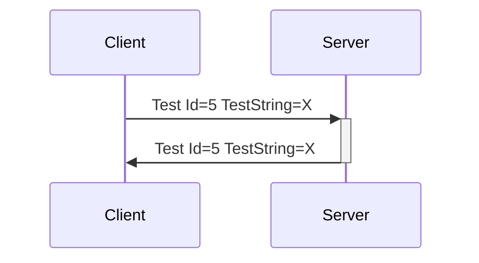

**Serialization Example:**

```json
[
  {
    "Test": {
      "Id": 5,
      "TestString": "Moo"
    }
  }
]
```
---
## RequestLog

**Reason for Deprecation:** Requesting logging means that the client, whoever that may be, can
request dumps of information from the server. When the client/server are in the same process, that's
fine. However, when the client may be remote to the server (for instance, a web app accessing
intiface desktop), this allows WAY too much information leakage, as the logging messages may be
quite verbose, unless the server is setup to ignore it. Also, this has nothing to do with
controlling sex toys. It was more for debugging situations that have never really arisen. If we need
logs, we can get them from servers, and we don't really need to fly them over the line.

**Description:** Requests that the server send all internal log messages to the client. Useful for
debugging.

**Introduced In Spec Version:** 0

**Last Updated In Spec Version:** 0

**Fields:**

* _Id_ (unsigned int): Message Id
* _LogLevel_ (string): The highest level of message to receive. Sending "Off" turns off messages,
  while sending "Trace" denotes that all log messages should be sent to the client. Valid LogLevel
  values:
  * Off
  * Fatal
  * Error
  * Warn
  * Info
  * Debug
  * Trace

**Expected Response:**

* Ok message with matching Id on successful logging request. Assuming the LogLevel was not "Off",
  Log type messages will be received after this.
* Error message on value or message error.

**Flow Diagram:**

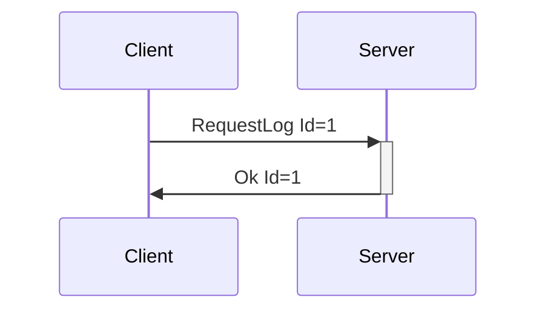

**Serialization Example:**

```json
[
  {
    "RequestLog": {
      "Id": 1,
      "LogLevel": "Warn"
    }
  }
]
```
---
## Log

**Reason for Deprecation:** See RequestLog reason.

**Description:** Log message from the server. Only sent after the client has sent a RequestLog
message with a level other than "Off".

**Introduced In Spec Version:** 0

**Last Updated In Spec Version:** 0

**Fields:**

* _Id_ (unsigned int): Message Id
* _LogLevel_ (string): The level of the log message.
  * Off 
  * Fatal
  * Error
  * Warn
  * Info
  * Debug
  * Trace
* _LogMessage_ (string): Log message.

**Expected Response:**

None. Server-to-Client message only.

**Flow Diagram:**

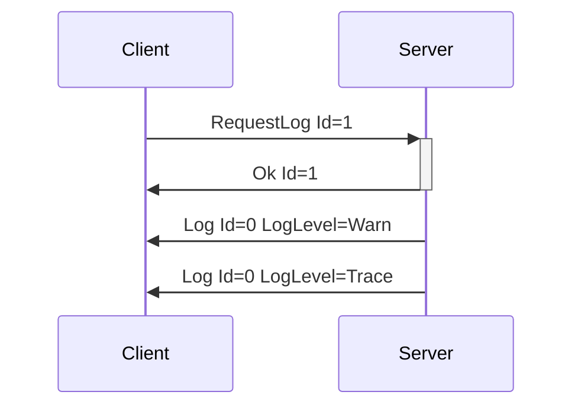

**Serialization Example:**

```json
[
  {
    "Log": {
      "Id": 0,
      "LogLevel": "Trace",
      "LogMessage": "This is a Log Message."
    }
  }
]
```
---

## VibrateCmd

**Reason for Deprecation:** Superceded by ScalarCmd.

**Description:** Causes a device that supports vibration to run specific vibration motors at a
certain speeds. Devices with multiple vibrator features may take multiple values. The
[FeatureCount](enumeration.md#messageattributes) attribute for the message in the
[DeviceList](enumeration.md#devicelist)/[DeviceAdded](enumeration.md#deviceadded) message will
contain that information.

**Introduced In Spec Version:** 1

**Last Updated In Spec Version:** 1

**Fields:**

* _Id_ (unsigned int): Message Id
* _DeviceIndex_ (unsigned int): Index of device
* _Speeds_ (array): Vibration speeds
  * _Index_ (unsigned int): Index of vibration motor
  * _Speed_ (double): Vibration speed with a range of [0.0-1.0]

**Expected Response:**

* Ok message with matching Id on successful request.
* Error message on value or message error.

**Flow Diagram:**


**Serialization Example:**

```json
[
  {
    "VibrateCmd": {
      "Id": 1,
      "DeviceIndex": 0,
      "Speeds": [
        {
          "Index": 0,
          "Speed": 0.5
        },
        {
          "Index": 1,
          "Speed": 1.0
        }
      ]
    }
  }
]
```
---

## BatteryLevelCmd

**Reason for Deprecation:** Superceded by SensorReadCmd.

**Description:** Requests that a device send its battery level.

**Introduced In Spec Version:** 2

**Last Updated In Spec Version:** 2

**Fields:**

* _Id_ (unsigned int): Message Id
* _DeviceIndex_ (unsigned int): Index of device to query for battery reading.

**Expected Response:**

* [BatteryLevelReading](deprecated.md#batterylevelreading) message with
  matching Id on successful request.
* Error message on value or message error.

**Flow Diagram:**

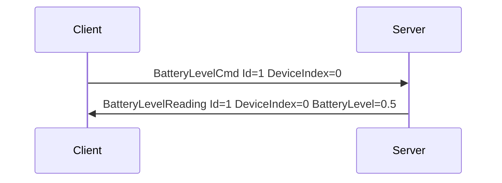

**Serialization Example:**

```json
[
  {
    "BatteryLevelCmd": {
      "Id": 1,
      "DeviceIndex": 0
    }
  }
]
```
---
## BatteryLevelReading

**Reason for Deprecation:** Superceded by SensorReading.

**Description:** Message containing a battery level reading from a
device, as requested by [BatteryLevelCmd](deprecated.md#batterylevelcmd).

**Introduced In Spec Version:** 2

**Last Updated In Spec Version:** 2

**Fields:**

* _Id_ (unsigned int): Message Id
* _DeviceIndex_ (unsigned int): Index of device battery reading is from.
* _BatteryLevel_ (double): Battery Level with a range of [0.0-1.0]

**Expected Response:**

* None. Server-to-Client message only.

**Flow Diagram:**


**Serialization Example:**

```json
[
  {
    "BatteryLevelReading": {
      "Id": 1,
      "DeviceIndex": 0,
      "BatteryLevel": 0.5
    }
  }
]
```
---
## RSSILevelCmd

**Reason for Deprecation:** Superceded by SensorReadCmd. Also never implemented in any official reference implementation of Buttplug.

**Description:** Requests that a device send its RSSI level.

**Introduced In Spec Version:** 2

**Last Updated In Spec Version:** 2

**Fields:**

* _Id_ (unsigned int): Message Id
* _DeviceIndex_ (unsigned int): Index of device to query for RSSI level.

**Expected Response:**

* [RSSILevelReading](deprecated.md#rssilevelreading) message with
  matching Id on successful request.
* Error message on value or message error.

**Flow Diagram:**

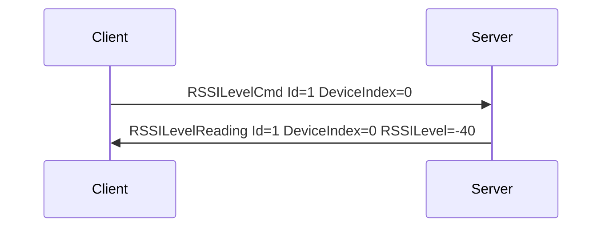

**Serialization Example:**

```json
[
  {
    "RSSILevelCmd": {
      "Id": 1,
      "DeviceIndex": 0
    }
  }
]
```
---
## RSSILevelReading

**Reason for Deprecation:** Superceded by SensorReading. Also never implemented in any official reference implementation of Buttplug.

**Description:** Message containing a RSSI level reading from a
device, as requested by [RSSILevelCmd](deprecated.md#rssilevelcmd).

**Introduced In Spec Version:** 2

**Last Updated In Spec Version:** 2

**Fields:**

* _Id_ (unsigned int): Message Id
* _DeviceIndex_ (unsigned int): Index of device the reading is from.
* _RSSILevel_ (int): RSSI Level, usually expressed as db gain, usually [-100:0]

**Expected Response:**

* None. Server-to-Client message only.

**Flow Diagram:**


**Serialization Example:**

```json
[
  {
    "RSSILevelReading": {
      "Id": 1,
      "DeviceIndex": 0,
      "RSSILevel": -40
    }
  }
]
```

---
## ScalarCmd

**Reason for Deprecation:** Superceded by ValueCmd.

**Description:** Sets the static level for a feature. For instance, the vibration speed of a
vibrator, the oscillating speed of a fucking machine, etc... The [Message
Attributes](enumeration.md#message-attributes-for-devicelist-and-deviceadded) for the ScalarCmd message in the
[DeviceList](enumeration.md#devicelist)/[DeviceAdded](enumeration.md#deviceadded) message contain
information on the actuator type and description, number of actuators, level ranges, and more.

Due to the amount of different controls that are scalars within haptics (vibration speed,
oscillation speed, inflate/constrict pressures, etc), this message provides flexibility to add new
acutuation types without having to introduce new messages into the protocol. The values accepted as
actuator types can be extended as needed.

In practice, ScalarCmd is meants to be exposed to developers via crafted APIs, i.e. having
vibrate()/rotate()/oscillate() etc functions available on a data structure that represents a device,
with the actuator types denoting which of those methods may be allowed. The ScalarCmd itself can be
exposed via API also, but this may lead to a lack of attention to context that could cause issues
(i.e. someone driving a vibrator and a fucking machine with the same power signals). Mitigation for
that type of issue may be UX related versus system/protocol related, by letting users set speed
limits and ranges for devices.

**Introduced In Spec Version:** 3

**Last Updated In Spec Version:** 3

**Fields:**

* _Id_ (unsigned int): Message Id
* _DeviceIndex_ (unsigned int): Index of device
* _Scalars_ (array): Scalar values to set actuators
  * _Index_ (unsigned int): Index of actuator
  * _Scalar_ (double): Actuator level with a range of [0.0-1.0]
  * _ActuatorType_ (string): Type of actuator that the user expects to control with this command.
    This is to make sure that context is correct between the client and server.

**Expected Response:**

* Ok message with matching Id on successful request.
* Error message on value or message error.

**Flow Diagram:**

```mermaid
sequenceDiagram
    Client->>+Server: ScalarCmd Id=1
    Server->>-Client: Ok Id=1
```

**Serialization Example:**

```json
[
  {
    "ScalarCmd": {
      "Id": 1,
      "DeviceIndex": 0,
      "Scalars": [
        {
          "Index": 0,
          "Scalar": 0.5,
          "ActuatorType": "Vibrate"
        },
        {
          "Index": 1,
          "Scalar": 1.0,
          "ActuatorType": "Inflate"
        }
      ]
    }
  }
]
```
---

## LinearCmd

**Reason for Deprecation:** Superceded by ValueWithParameterCmd.

**Description:** Causes a device that supports linear movement to move to a position over a certain
amount of time. Devices with multiple linear actuator features may take multiple values.

**Introduced In Spec Version:** 1

**Last Updated In Spec Version:** 1

**Fields:**

* _Id_ (unsigned int): Message Id
* _DeviceIndex_ (unsigned int): Index of device
* _Vectors_ (array): Linear actuator speeds and positions
  * _Index_ (unsigned int): Index of linear actuator
  * _Duration_ (unsigned int): Movement time in milliseconds
  * _Position_ (double): Target position with a range of [0.0-1.0]

**Expected Response:**

* Ok message with matching Id on successful request.
* Error message on value or message error.

**Flow Diagram:**

```mermaid
sequenceDiagram
    Client->>+Server: LinearCmd Id=1
    Server->>-Client: Ok Id=1
```

**Serialization Example:**

```json
[
  {
    "LinearCmd": {
      "Id": 1,
      "DeviceIndex": 0,
      "Vectors": [
        {
          "Index": 0,
          "Duration": 500,
          "Position": 0.3
        },
        {
          "Index": 1,
          "Duration": 1000,
          "Position": 0.8
        }
      ]
    }
  }
]
```
---
## RotateCmd

**Reason for Deprecation:** Superceded by ValueWithParameterCmd.

**Description:** Causes a device that supports rotation to rotate at a certain speeds in specified
directions. Devices with multiple rotating features may have multiple values. 

**Introduced In Spec Version:** 1

**Last Updated In Spec Version:** 1

**Fields:**

* _Id_ (unsigned int): Message Id
* _DeviceIndex_ (unsigned int): Index of device
* _Rotations_ (array): Rotation speeds
  * _Index_ (unsigned int): Index of rotation motor
  * _Speed_ (double): Rotation speed with a range of [0.0-1.0]
  * _Clockwise_ (boolean): Direction of rotation (clockwise may be subjective)

**Expected Response:**

* Ok message with matching Id on successful request.
* Error message on value or message error.

**Flow Diagram:**

```mermaid
sequenceDiagram
    Client->>+Server: RotateCmd Id=1
    Server->>-Client: Ok Id=1
```

**Serialization Example:**

```json
[
  {
    "RotateCmd": {
      "Id": 1,
      "DeviceIndex": 0,
      "Rotations": [
        {
          "Index": 0,
          "Speed": 0.5,
          "Clockwise": true
        },
        {
          "Index": 1,
          "Speed": 1.0,
          "Clockwise": false
        }
      ]
    }
  }
]
```

---
## DeviceAdded

**Reason for Deprecation:** Removed in Spec v4, simplified protocol to only send DeviceList.

**Description:** Sent by the server whenever a device is added to the system. Can happen at any time
after identification stage (i.e. after client is connected), as it is assumed many server
implementations will support devices with hotplugging capabilities that do not require specific
scanning/discovery sessions.

**Introduced In Spec Version:** 0

**Last Updated In Spec Version**: 3 (See [Deprecated Messages](deprecated.md) for older versions.)

**Fields:**

* _Id_ (unsigned int): Message Id
* _DeviceName_ (string): Descriptive name of the device, as taken from the base device
  configuration file.
* _DeviceIndex_ (unsigned integer): Index used to identify the device when sending Device Messages.
* _DeviceMessageTimingGap_ (_optional_, unsigned integer): Recommended minimum gap between device
  commands, in milliseconds. This is only a recommendation, and will not be enforced on the
  server, as most times the server does not actually know the exact message gap timing required
  (hence this being recommended). Enforcement on the client (with developer option to disable) is
  encouraged. Optional field, not required to be included in message. Missing value should be assumed that server does not know recommended message gap.
* _DeviceDisplayName_ (_optional_, string): User provided display name for a device. Useful for
  cases where a users may have multiple of the same device connected. Optional field, not required
  to be included in message. Missing value means that no device display name is set, and device
  name should be used.
* _DeviceMessages_ (dictionary): Accepted Device Messages 
  * Keys (string): Type names of Device Messages that the device will accept
  * Values (Array of [Message
    Attributes](enumeration.md#message-attributes-for-devicelist-and-deviceadded)): Attributes for
    the Device Messages. Each feature is a seperate array element, and its index in the array matches how it should be addressed in generic command messages. For instance, in the example below, the Clitoral Stimulator would be Actuator Index 0 in ScalarCmd.

**Expected Response:**

None. Server-to-Client message only.

**Flow Diagram:**

```mermaid
sequenceDiagram
    participant Client
    participant Server
    Server->>Client: DeviceAdded Id=0
```

**Serialization Example:**

```json
[
  {
    "DeviceAdded": {
      "Id": 0,
      "DeviceName": "Test Vibrator",
      "DeviceIndex": 0,
      "DeviceMessageTimingGap": 100,
      "DeviceDisplayName": "Rabbit Vibrator",
      "DeviceMessages": {
        "ScalarCmd": [
          {
            "StepCount": 20,
            "FeatureDescriptor": "Clitoral Stimulator",
            "ActuatorType": "Vibrate"
          },
          {
            "StepCount": 20,
            "FeatureDescriptor": "Insertable Vibrator",
            "ActuatorType": "Vibrate"
          }
        ],
        "StopDeviceCmd": {}
       }
    }
  }
]
```
---

## DeviceRemoved

**Reason for Deprecation:** Removed in Spec v4, simplified protocol to only send DeviceList.

**Description:** Sent by the server whenever a device is removed from the system. Can happen at any
time after identification.

**Introduced In Spec Version:** 0

**Last Updated In Spec Version:** 0

**Fields:**

* _Id_ (unsigned int): Message Id
* _DeviceIndex_ (unsigned integer): Index used to identify the device when sending Device Messages.

**Expected Response:**

None. Server-to-Client message only.

**Flow Diagram:**

```mermaid
sequenceDiagram
    participant Client
    participant Server
    Server->>Client: DeviceRemoved Id=0
```

**Serialization Example:**

```json
[
  {
    "DeviceRemoved": {
      "Id": 0,
      "DeviceIndex": 0
    }
  }
]
```
---
## DeviceList - Spec v3

**Reason for Deprecation:** Updated in Spec v4 for new features system

**Description:** Server reply to a client request for a device list.

**Introduced In Spec Version:** 0

**Last Updated In Spec Version:** 3 (See [Deprecated Messages](deprecated.md) for older versions.)

**Fields:**

* _Id_ (unsigned int): Message Id
* _Devices_ (array): Array of device objects
  * _DeviceName_ (string): Descriptive name of the device, as taken from the base device
    configuration file.
  * _DeviceIndex_ (unsigned integer): Index used to identify the device when sending Device
    Messages.
  * _DeviceMessageTimingGap_ (_optional_, unsigned integer): Recommended minimum gap between device
    commands, in milliseconds. This is only a recommendation, and will not be enforced on the
    server, as most times the server does not actually know the exact message gap timing required
    (hence this being recommended). Enforcement on the client (with developer option to disable) is
    encouraged. Optional field, not required to be included in message. Missing value should be
    assumed that server does not know recommended message gap.
  * _DeviceDisplayName_ (_optional_, string): User provided display name for a device. Useful for
    cases where a users may have multiple of the same device connected. Optional field, not required
    to be included in message. Missing value means that no device display name is set, and device
    name should be used.
  * _DeviceMessages_ (dictionary): Accepted Device Messages 
    * Keys (string): Type names of Device Messages that the device will accept
    * Values (Array of [Message
      Attributes](enumeration.md#message-attributes-for-devicelist-and-deviceadded)):
      Attributes for the Device Messages. Each feature is a seperate array element, and its index in the array matches how it should be addressed in generic command messages. For instance, in the example below, the Clitoral Stimulator would be Actuator Index 0 in ScalarCmd.

**Expected Response:**

None. Server-to-Client message only.

**Flow Diagram:**

```mermaid
sequenceDiagram
    Client->>+Server: RequestDeviceList Id=1
    Server->>-Client: DeviceList Id=1
```

**Serialization Example:**

```json
[
  {
    "DeviceList": {
      "Id": 1,
      "Devices": [
        {
          "DeviceName": "Test Vibrator",
          "DeviceIndex": 0,
          "DeviceMessages": {
            "ScalarCmd": [
              {
                "StepCount": 20,
                "FeatureDescriptor": "Clitoral Stimulator",
                "ActuatorType": "Vibrate"
              },
              {
                "StepCount": 20,
                "FeatureDescriptor": "Insertable Vibrator",
                "ActuatorType": "Vibrate"
              }
            ],
            "StopDeviceCmd": {}
          }
        },
        {
          "DeviceName": "Test Stroker",
          "DeviceIndex": 1,
          "DeviceMessageTimingGap": 100,
          "DeviceDisplayName": "User set name",
          "DeviceMessages": {
            "LinearCmd": [ {
              "StepCount": 100,
              "FeatureDescriptor": "Stroker",
              "ActuatorType": "Linear"
            } ],
            "StopDeviceCmd": {}
          }
        }
      ]
    }
  }
]
```
---
## Message Attributes for DeviceAdded/DeviceList - Spec v3

**Reason for Deprecation:** Removed in Spec v4, simplified protocol to only send DeviceList, so
folding section in there and updating for features.

**Description:** A collection of message attributes. This object is always an array element of a
Device Message key/value pair within a [DeviceList](enumeration.md#devicelist) or
[DeviceAdded](enumeration.md#deviceadded) message. Not all attributes are relevant for all Device
Messages on all Devices; in these cases the attributes will not be included.

**Introduced In Spec Version:** 1

**Last Updated In Spec Version**: 3 (See [Deprecated Messages](deprecated.md) for older versions.)

**Attributes:**

* _FeatureDescriptor_
  * Valid for Messages: ScalarCmd, RotateCmd, LinearCmd, SensorReadCmd
  * Type: String
  * Description: Text descriptor for a feature.
* _StepCount_ 
  * Valid for Messages: ScalarCmd, RotateCmd, LinearCmd
  * Type: unsigned int
  * Description: For each feature, lists the number of discrete steps the feature can use. This
    value can be used in calculating the 0.0-1.0 range required for ScalarCmd and other messages.
* _ActuatorType_
  * Valid for Messages: ScalarCmd, RotateCmd, LinearCmd
  * Type: String
  * Description: Type of actuator this feature represents.
* _SensorType_
  * Valid for Messages: SensorReadCmd, SensorSubscribeCmd
  * Type: String
  * Description: Sensor types that can be read by Sensor.
* _SensorRange_
  * Valid for Messages: SensorReadCmd, SensorSubscribeCmd (but applies to values returned by SensorReading)
  * Type: array of arrays of 2 integers
  * Description: Range of values a sensor can return. As sensors can possibly return multiple values
    in the same SensorReading message (i.e. an 3-axis accelerometer may return all 3 axes in one read), this is sent as an array of ranges. The length of this array will always match the number of readings that will be returned from a sensor, and can be used to find the reading count for a sensor.
* _Endpoints_
  * Valid for Messages: RawReadCmd, RawWriteCmd, RawSubscribeCmd
  * Type: array of strings
  * Description: Endpoints that can be used by Raw commands.
---
## RequestServerInfo - Spec v1

**Reason for Deprecation:** Added Major/Minor versions back in with spec v4.

**Description:** Sent by the client to register itself with the server, and request info from the
server.

**Introduced In Spec Version:** 0

**Last Updated In Spec Version:** 1

**Fields:**

* _Id_ \(unsigned int\): Message Id
* _ClientName_ \(string\): Name of the client, for the server to use for UI if needed. Cannot be
  null.
* _MessageVersion_ \(uint\): Message spec version of the client software.

**Expected Response:**

* ServerInfo message on success
* Error message on malformed message, null client name, server not able to use requested message
  spec version, or other error.

**Flow Diagram:**

```mermaid
sequenceDiagram
    Client->>Server: RequestServerInfo Id=0
    Server->>Client: ServerInfo Id=0
```

**Serialization Example:**

```json
[
  {
    "RequestServerInfo": {
      "Id": 1,
      "ClientName": "Test Client",
      "MessageVersion": 1
    }
  }
]
```
---
## ServerInfo - Spec v2

**Reason for Deprecation:** Added Major/Minor versions back in with spec v4.

**Description:** Send by server to client, contains information about the server name \(optional\),
template version, and ping time expectations.

**Introduced In Spec Version:** 0

**Last Updated In Spec Version:** 2

**Fields:**

* _Id_ \(unsigned int\): Message Id
* _ServerName_ \(string\): Name of the server. Can be null \(0-length\).
* _MessageVersion_ \(uint\): Message template version of the server software. Should equal
  the version that the client sent in RequestServerInfo.
* _MaxPingTime_ \(uint\): Maximum internal for pings from the client, in milliseconds. If a client
  takes to longer than this time between sending Ping messages, the server is expected to
  disconnect.

**Expected Response:**

None. Server-To-Client message only.

**Flow Diagram:**

```mermaid
sequenceDiagram
    Client->>Server: RequestServerInfo Id=0
    Server->>Client: ServerInfo Id=0
```

**Serialization Example:**

```json
[
  {
    "ServerInfo": {
      "Id": 1,
      "ServerName": "Test Server",
      "MessageVersion": 1,
      "MaxPingTime": 100
    }
  }
]
```

---
## RawWriteCmd

**Reason for Deprecation:** Raw commands removed completely in spec v4.

**Description:** Client request to have the server write a byte array to a device endpoint.

**Introduced In Spec Version:** 2

**Last Updated In Spec Version:** 2

**Fields:**

* _Id_ (unsigned int): Message Id
* _DeviceIndex_ (unsigned int): Index of device to write to.
* _Endpoint_ (string): Name of endpoint to write data to.
* _Data_ (array of unsigned 8-bit int): Raw data to write to endpoint.
* _WriteWithResponse_ (boolean): True if BLE WriteWithResponse required, False otherwise.

**Expected Response:**

* Ok message with matching Id on successful request.
* Error message on value or message error.

**Flow Diagram:**

```mermaid
sequenceDiagram
    Client->>+Server: RawWriteCmd Id=1
    Server->>-Client: Ok Id=1
```

**Serialization Example:**

```json
[
  {
    "RawWriteCmd": {
      "Id": 1,
      "DeviceIndex": 0,
      "Endpoint": "tx",
      "Data": [0, 1, 0],
      "WriteWithResponse": false
    }
  }
]
```
---
## RawReadCmd

**Reason for Deprecation:** Raw commands removed completely in spec v4.

**Description:** Client request to have the server read a byte array from a device endpoint.

**Introduced In Spec Version:** 2

**Last Updated In Spec Version:** 2

**Fields:**

* _Id_ (unsigned int): Message Id
* _DeviceIndex_ (unsigned int): Index of device to read data from.
* _Endpoint_ (string): Name of endpoint to read data from.
* _ExpectedLength_ (unsigned int): Amount of data to read, 0 if "Read all currently available".
* _WaitForData_ (boolean): True if return should only be sent when there is data available, or until
  expected length is met.

**Expected Response:**

* RawReading message with matching Id on successful request.
* Error message on value or message error.

**Flow Diagram:**

```mermaid
sequenceDiagram
    Client->>+Server: RawReadCmd Id=1
    Server->>-Client: RawReading Id=1
```

**Serialization Example:**

```json
[
  {
    "RawReadCmd": {
      "Id": 1,
      "DeviceIndex": 0,
      "Endpoint": "tx",
      "ExpectedLength": 0,
      "WaitForData": false
    }
  }
]
```

---
## RawReading

**Reason for Deprecation:** Raw commands removed completely in spec v4.

**Description:** Server response when data is read (in response to RawReadCmd) or received (after
RawSubscribe) from a device endpoint.

**Introduced In Spec Version:** 2

**Last Updated In Spec Version:** 2

**Fields:**

* _Id_ (unsigned int): Message Id. Can be 0 in cases of subscription data.
* _DeviceIndex_ (unsigned int): Index of device to data was read from.
* _Endpoint_ (string): Name of endpoint to data was read from.
* _Data_ (array of unsigned 8-bit int): Raw data read from endpoint.

**Serialization Example:**

```json
[
  {
    "RawReading": {
      "Id": 1,
      "DeviceIndex": 0,
      "Endpoint": "rx",
      "Data": [0, 1, 0]
    }
  }
]
```

---
## RawSubscribeCmd

**Reason for Deprecation:** Raw commands removed completely in spec v4.

**Description:** Client request to have the server subscribe and send all data that comes in from an
endpoint that is not explicitly read. Usually useful for Bluetooth notify endpoints, or other
streaming data endpoints.

**Introduced In Spec Version:** 2

**Last Updated In Spec Version:** 2

**Fields:**

* _Id_ (unsigned int): Message Id
* _DeviceIndex_ (unsigned int): Index of device to subscribe to.
* _Endpoint_ (string): Name of endpoint to subscribe to.

**Expected Response:**

* Ok if subscription is successful, followed by RawReading
  messages on all new readings.
* Error message on value or message error.

**Flow Diagram:**

```mermaid
sequenceDiagram
    Client->>+Server: RawSubscribeCmd Id=1
    Server->>-Client: Ok Id=1
    Server->>+Client: RawReading Id=0
    Server->>+Client: RawReading Id=0
```

**Serialization Example:**

```json
[
  {
    "RawSubscribeCmd": {
      "Id": 1,
      "DeviceIndex": 0,
      "Endpoint": "tx"
    }
  }
]
```

---
## RawUnsubscribeCmd

**Reason for Deprecation:** Raw commands removed completely in spec v4.

**Description:** Client request to have the server unsubscribe from an endpoint to which it had
previously subscribed.

**Introduced In Spec Version:** 2

**Last Updated In Spec Version:** 2

**Fields:**

* _Id_ (unsigned int): Message Id
* _DeviceIndex_ (unsigned int): Index of device to subscribe to.
* _Endpoint_ (string): Name of endpoint to subscribe to.

**Expected Response:**

* Ok if unsubscription is successful.
* Error message on value or message error.

**Flow Diagram:**

```mermaid
sequenceDiagram
    Client->>+Server: RawUnsubscribeCmd Id=1
    Server->>-Client: Ok Id=1
```

**Serialization Example:**

```json
[
  {
    "RawUnsubscribeCmd": {
      "Id": 1,
      "DeviceIndex": 0,
      "Endpoint": "tx"
    }
  }
]
```

