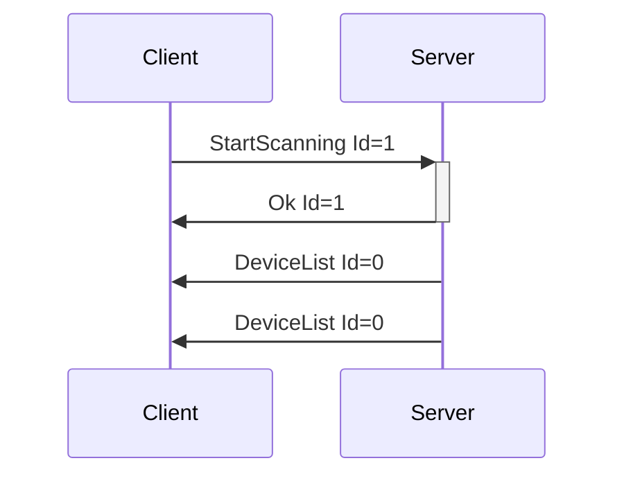
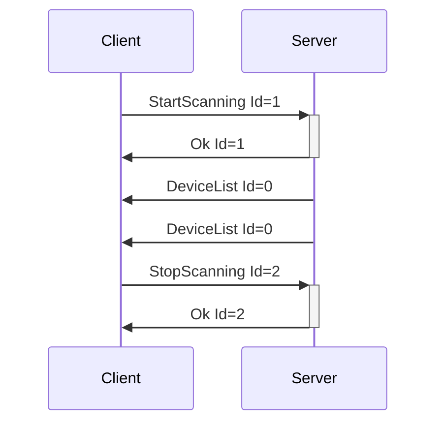
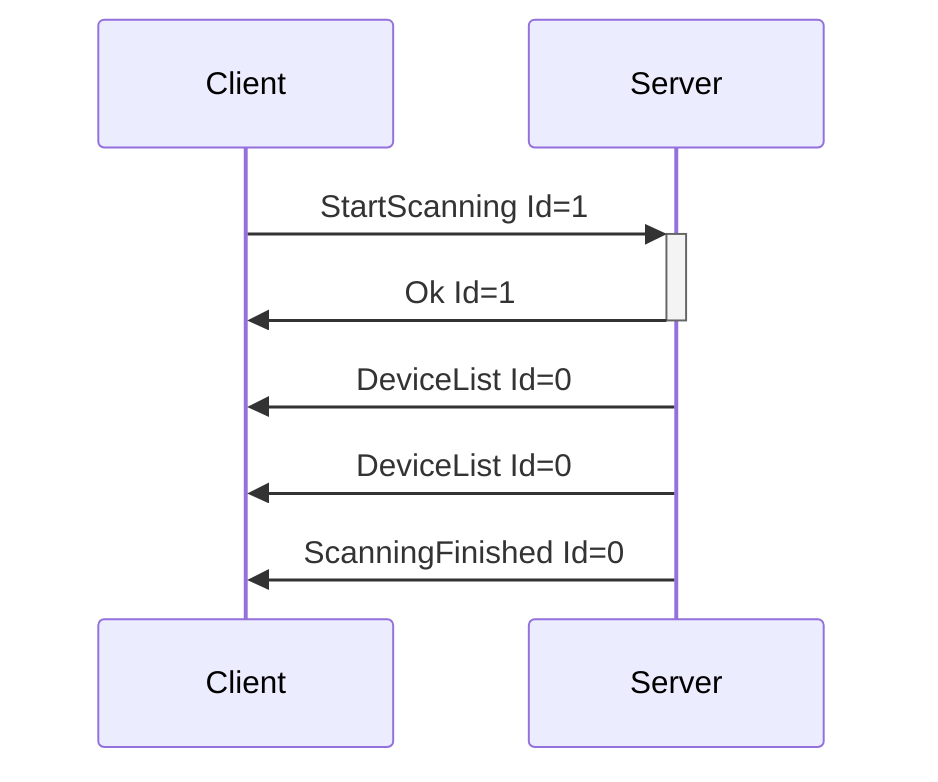
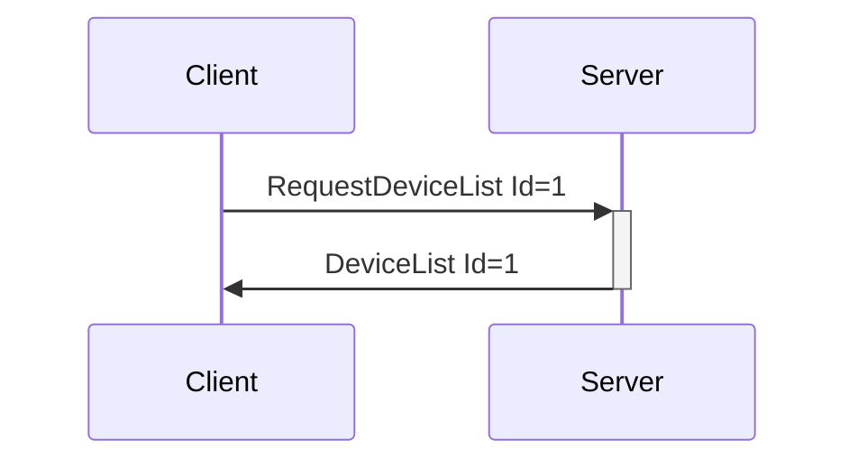

# Device Discovery Messages

Messages relating to finding and getting information about devices connected to the system.

---
## StartScanning

**Description:** Client request to have the server start scanning for devices on all busses that it
knows about. Useful for protocols like Bluetooth, which require an explicit discovery phase.

**Introduced In Spec Version:** 0

**Last Updated In Spec Version:** 0

**Fields:**

* _Id_ (unsigned int): Message Id

**Expected Response:**

* Ok message with matching Id on successful request.
* Error message on value or message error.

**Flow Diagram:**



**Serialization Example:**

```json
[
  {
    "StartScanning": {
      "Id": 1
    }
  }
]
```
---
## StopScanning

**Description:** Client request to have the server stop scanning for devices. Useful for protocols
like Bluetooth, which may not timeout otherwise.

**Introduced In Spec Version:** 0

**Last Updated In Spec Version:** 0

**Fields:**

* _Id_ (unsigned int): Message Id

**Expected Response:**

* Ok message with matching Id on successful request.
* Error message on value or message error.

**Flow Diagram:**



**Serialization Example:**

```json
[
  {
    "StopScanning": {
      "Id": 1
    }
  }
]
```
---
## ScanningFinished

**Description:** Sent by the server once it has stopped scanning on all busses. Since systems may
have timeouts that are not controlled by the server, this is a separate message from the
StopScanning flow. ScanningFinished can happen without a StopScanning call.

In reality, this event is usually only useful when working with systems that can only scan for a single device at a time, like WebBluetooth. When on normal desktop/mobile APIs, it should be assumed that running StartScanning/StopScanning will be the main usage.

**Introduced In Spec Version:** 0

**Last Updated In Spec Version:** 0

**Fields:**

* _Id_ (unsigned int): Message Id

**Expected Response:**

None. Server-to-Client only.

**Flow Diagram:**



**Serialization Example:**

```json
[
  {
    "ScanningFinished": {
      "Id": 0
    }
  }
]
```
---
## RequestDeviceList

**Description:** Client request to have the server send over its known device list, without starting
a full scan.

**Introduced In Spec Version:** 0

**Last Updated In Spec Version:** 0

**Fields:**

* _Id_ (unsigned int): Message Id

**Expected Response:**

* DeviceList message with matching Id on successful request.
* Error message on value or message error.

**Flow Diagram:**



**Serialization Example:**

```json
[
  {
    "RequestDeviceList": {
      "Id": 1
    }
  }
]
```