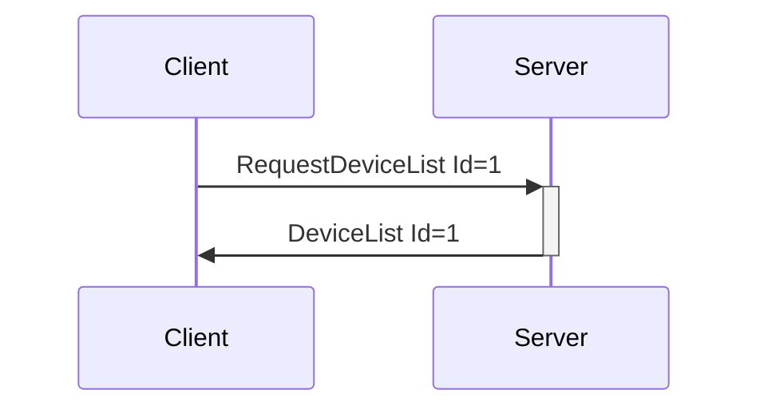

# Device Information Messages

Messages that convey information about devices currently connected to the system. All of the following messages are sent Server -> Client, either in response to `RequestDeviceList` or on connection/disconnection of a device.

---
## DeviceList

**Description:** Server reply to a client request for a device list.

**Introduced In Spec Version:** 0

**Last Updated In Spec Version:** 4 (See [Deprecated Messages](deprecated.md) for older versions.)

**Fields:**

* _Id_ (unsigned int): Message Id
* _Devices_ (array): Array of device objects
  * _DeviceName_ (string): Descriptive name of the device, as taken from the base device
    configuration file.
  * _DeviceIndex_ (unsigned integer): Index used to identify the device when sending Device
    Messages.
  * _DeviceMessageTimingGap_ (unsigned integer): Recommended minimum gap between device
    commands, in milliseconds, **TO BE ENFORCED ON THE SERVER**. If multiple messages are sent within the timespan defined here, only the latest commands will be sent on the next message trigger. This relieves developers of having to regulate input from users or tune their clients, at the cost of added server complexity. As no one but the Buttplug Core Team writes servers, that means you're getting less work for free here. If this is set to 0, it means there is no minimum update rate (if there is a device updating at after that 1khz in buttplug, please get in touch, I have concerns).
  * _DeviceDisplayName_ (_optional_, string): User provided display name for a device. Useful for
    cases where a users may have multiple of the same device connected. Optional field, not required
    to be included in message. Missing value means that no device display name is set, and device
    name should be used.
  * _DeviceFeatures_ (array of feature objects, with each object having the following fields)
    * _Description_ (string): Text descriptor for a feature.
    * _FeatureIndex_ (unsigned 32-bit integer): Index that should be used to refer to the feature in
      messages like `ValueCmd`, `SensorReadCmd`, etc...
    * _FeatureType_ (string): **Recommended** type for the feature, but _not necessarily the only
      thing it can do_. For instance, a stroker like the Lovense Solace Pro or Kiiroo Keon would have a feature type of _PositionWithDuration_, but can also handle the _Position_ message. This is useful for programmatically deducing more information about what a feature does.
    * _Output_ (Object, may be null): Represents an outputs that are part of this feature. A map of
      OutputType to information objects.
      * \[_OutputType_\] (OutputType as String): OutputType is used as a key here, so this field
        would be something like "Vibrate", "Position", etc...
        * _StepCount_ (unsigned 32-bit integer): Number of steps usable for this output type. For
          instance, if a vibrator has 20 steps of speed control, StepCount will be 20. However, if a user has reduced the usable range in their server config, it may be < 20.
    * _Input_ (Object, may be null): Represents a sensor that may be part of this feature. A map of
      InputType to information objects.
      * \[_InputType_\] (InputType as String): InputType is used as a key here, so this field
        would be something like "Battery", "Pressure", etc...
        * _InputCommandType_ (array of strings): Some combination of "Read" and/or "Subscribe".
        * _ValueRange_ (Range, array of 2 signed 32-bit integer values): Range of values that may be
          received from the sensor, if known.
    
**Expected Response:**

None. Server-to-Client message only.

**Flow Diagram:**



**Serialization Example:**

```json
[
  {
    "DeviceList": {
      "Id": 1,
      "Devices": [
        {
          "DeviceName": "Test Vibrator",
          "DeviceIndex": 0,
          "Features": [
            {
              "FeatureType": "Vibrate",
              "Descriptor": "Clitoral Stimulator",
              "Output": {
                "Vibrate": {
                  "StepCount": 20,
                }
              }
            },
            {
              "FeatureType": "Vibrate",
              "Descriptor": "Insertable Stimulator",
              "Output": {
                "Vibrate": {
                  "StepCount": 20,
                }
              }
            },
            {
              "FeatureType": "Battery",
              "Descriptor": "Battery",
              "Input": {
                "Battery": {
                  "ValueRange": [0, 100],
                  "InputCommandType": ["Read"]
                }
              }
            }
          ]
        },
        {
          "DeviceName": "Test Stroker",
          "DeviceIndex": 1,
          "DeviceMessageTimingGap": 100,
          "DeviceDisplayName": "User set name",
          "Features": [
            {
              "FeatureType": "PositionWithDuration",
              "Descriptor": "Stroker",
              "Output": {
                "PositionWithDuration": {
                  "StepCount": 100,
                }
              },
              "Input": {
                "Position": {
                  "ValueRange": [0, 100],
                  "InputCommandType": ["Read", "Subscribe"]
                }
              }
            },
            {
              "FeatureType": "RSSI",
              "Descriptor": "Bluetooth Radio RSSI",
              "Input": {
                "RSSI": {
                  "ValueRange": [-10, -100],
                  "InputCommandType": ["Read"]
                }
              }
            }

          ]
        }
      ]
    }
  }
]
```
