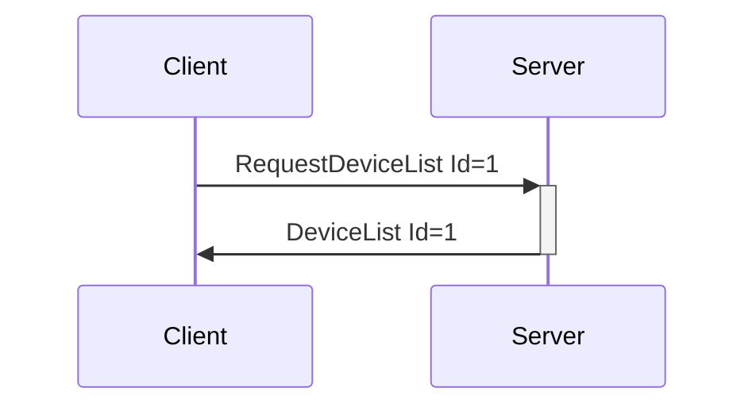

# Device Information Messages

Messages that convey information about devices currently connected to the system. All of the following messages are sent Server -> Client, either in response to `RequestDeviceList` or on connection/disconnection of a device.

---
## DeviceList

**Description:** Server reply to a client request for a device list, or sent as an event when a device is connected or disconnected.

**Introduced In Spec Version:** 0

**Last Updated In Spec Version:** 4 (See [Deprecated Messages](deprecated.md) for older versions.)

**Fields:**

* _Id_ (unsigned int): Message Id
* _Devices_ (map of indexes to device object, with each object having the following fields):
  * _DeviceName_ (string): Descriptive name of the device, as taken from the base device
    configuration file.
  * _DeviceIndex_ (unsigned integer): Index used to identify the device when sending Device
    Messages.
    * This is a repeat of the map key
  * _DeviceMessageTimingGap_ (unsigned integer): Recommended minimum gap between device
    commands, in milliseconds, **TO BE ENFORCED ON THE SERVER**. If multiple messages are sent within the timespan defined here, only the latest commands will be sent on the next message trigger. This relieves developers of having to regulate input from users or tune their clients, at the cost of added server complexity. As no one but the Buttplug Core Team writes servers, that means you're getting less work for free here. If this is set to 0, it means there is no minimum update rate (if there is a device updating at 1khz in buttplug, please get in touch, I have concerns).
  * _DeviceDisplayName_ (_optional_, string): User provided display name for a device. Useful for
    cases where a users may have multiple of the same device connected. Optional field, not required
    to be included in message. Missing value means that no device display name is set, and device
    name should be used.
  * _DeviceFeatures_ (map of indexes to feature objects, with each object having the following fields)
    * _Description_ (string): Text descriptor for a feature.
    * _FeatureIndex_ (unsigned 32-bit integer): Index that should be used to refer to the feature in
      messages like `ValueCmd`, `SensorReadCmd`, etc...
      * This is a repeat of the map key.
    * _Output_ (Object, may be null): Represents an outputs that are part of this feature. A map of
      OutputType to information objects. If a feature lists multiple output types, this means that the feature can be controlled through different contexts. For instance, a feature having both _Position_ and _PositionWithDuration_ output types means that the feature can move instantaneously to a goal position, or can move to the goal position over a certain amount of itme.
      * \[_OutputType_\] (OutputType as String): OutputType is used as a key here, so this would be
        something like _Vibrate_, _Position_, etc... **IMPORTANT**: Fields for this will change based on the key value. See below for which fields are valid per output type.
        * _Value_ (Signed 32-bit integer range): Range of the value this output type can be set to.
          It is assumed that once a value is set, it will not be reset until _OutputCmd_ is called
          again for the same feature. This can be used as a 2-dimensional value, for instance, a rotation feature that has direction may have a range of _[-x, x]_ to denote that it can rotate in 2 different directions.
          * Valid for Output Types: _Vibrate_, _Rotate_, _Spray_, _Oscillate_, _Constrict_, _Led_, _Temperature_
        * _Position_ (Unsigned 32-bit integer range): Range of the position setting for output type
          that use a position value.
          * Valid for Output Types: _Position_, _PositionWithDuration_
        * _Duration_ (Unsigned 32-bit integer range, in milliseconds): Range of duration values, in
          milliseconds, for output types that use time
          * Valid for Output Types: _PositionWithDuration_
    * _Input_ (Object, may be null): Represents a sensor that may be part of this feature. A map of
      InputType to information objects.
      * \[_InputType_\] (InputType as String): InputType is used as a key here, so this field
        would be something like "Battery", "Pressure", etc...
        * _InputCommandType_ (array of strings): Some combination of "Read" and/or "Subscribe".
        * _ValueRange_ (Range, array of 2 signed 32-bit integer values): Range of values that may be
          received from the sensor, if known.
    
:::tip Why are the DeviceIndex and FeatureIndex repeated as map keys and object fields?

DeviceIndex and FeatureIndex are how client implementations refer to a device in InputCmd and OutputCmd messages. They are the main identifiers for Buttplug. In most client implementations we've built so far, we end up using Map\<number, object\> types to represent Devices and Features, mapping indexes to the related objects. However, for the objects themselves, it tends be to handy for the object to know its index when forming device control messages.

With client ergonomics in mind, we just pack device info this way to begin with, so that serialization can happen from our base storage structures, and deserialization gives us the type of data structures we usually had to build by iterating through object arrays in past versions. This also gives us the added bonus of not being able to somehow pack devices with matching IDs (which would be a massive bug anyways but now it's not even structurally possible.).

There is some awkwardness in the JSON implementation of this, as object field names cannot be numeric. These are normally converted to strings when serialized, then back to numeric types automatically when deserialized for whatever language a client may be implemented in, assuming it has a decent serde library.

For those screaming "BUT ADDED SIZE AND REDUNDANCY AND YOU COULD STILL SOMEHOW PACK KEYS THAT DON'T MATCH INTERNAL INDEX FIELDS": DeviceList messages are sent a few times a minutes, so size doesn't matter. We could screw up consistency, but once again that'd be a huge bug and there's been one server implementation for 8 years.

:::

**Expected Response:**

None. Server-to-Client message only.

**Flow Diagram:**



**Serialization Example:**

```json
[
  {
    "DeviceList": {
      "Id": 1,
      "Devices": {
        "0": {
          "DeviceName": "Test Vibrator",
          "DeviceIndex": 0,
          "Features": {
            "0": {
              "FeatureIndex": 0,
              "Descriptor": "Clitoral Stimulator",
              "Output": {
                "Vibrate": {
                  "Value": [0, 20]
                }
              }
            },
            "1": {
              "FeatureIndex": 1,
              "Descriptor": "Insertable Stimulator",
              "Output": {
                "Vibrate": {
                  "Value": [0, 20]
                }
              }
            },
            "2": {
              "FeatureIndex": 2,
              "Descriptor": "Rotating Head with Directional Control",
              "Output": {
                "Vibrate": {
                  "Value": [-20, 20]
                }
              }
            },
            "3": {
              "FeatureIndex": 3,
              "Descriptor": "Battery",
              "Input": {
                "Battery": {
                  "ValueRange": [0, 100],
                  "InputCommandType": ["Read"]
                }
              }
            }
          }
        },
        "1": {
          "DeviceName": "Test Stroker",
          "DeviceIndex": 1,
          "DeviceMessageTimingGap": 100,
          "DeviceDisplayName": "User set name",
          "Features": {
            "0": {
              "FeatureIndex": 0,
              "Descriptor": "Stroker",
              "Output": {
                "PositionWithDuration": {
                  "Position": [0, 100],
                  "Duration": [0, 100000]
                },
                "Position": {
                  "Position": [0, 100]
                }
              },
              "Input": {
                "Position": {
                  "ValueRange": [0, 100],
                  "InputCommandType": ["Read", "Subscribe"]
                }
              }
            },
            "1": {
              "FeatureIndex": 1,
              "Descriptor": "Bluetooth Radio RSSI",
              "Input": {
                "RSSI": {
                  "ValueRange": [-10, -100],
                  "InputCommandType": ["Read"]
                }
              }
            }
          }
        }
      }
    }
  }
]
```

## Device Feature Output Types

Device feature output types denote what a device can physically output. They could also be thought of as _actuators_ (but we call them _outputs_ because, you know, buttplug dot io and all).

Unless denoted in the types listed in _DeviceInfo_ or here, it should be assumed that values for output types are arbitrary and have no useful units of measurement conveyed.

### Vibrate

Speeds of a vibrator feature. There are no units given for this output type, as there is no standard for measuring device output within toys. All sex toys currently on the market that Buttplug handles provide a set amount of speed steps that a vibrator can be set to, but the range and output power vary wildly.

### Rotate

Speeds and direction of a rotation feature. Whether this is a single or dual direction rotation is denoted via the range in _DeviceInfo_; _[0, x]_ means the feature can only rotate in a single direction at a speed, _[-x, x]_ means it can rotate clockwise as a speed if positive, counter-clockwise at a speed if negative.

### Oscillate

Speed of an osillating feature. This could be something like a fucking machine, a thrusting dildo, or a stroker without the ability to set positions.

### Led

Light amount of an LED feature on the device. For an LED feature with range [0, x], 0 should be considered off, x is the brightest the LED can get. Devices with multiple LED colors will have one feature per color.

### Temperature

Temperature of a feature that is a heater or cooler. Like rotation, range can be `[-x, x]`, where x < 0 is cooling (assuming the feature has cooling), x > 0 is heating (assuming the feature has heating), and 0 is off.

### Spray

Spray power, for devices like lube shooters. It's expected that this will be a temporary, single spray event. Any time the spray outputcmd is received, it will be considered a request to run a spray event.

### Position

Goal position of a feature, assumed to be a servo that can move basically instantaneously to a goal position. Useful for very fast real time updated in devices that can handle them, such as a wired stroker that can be controlled in real time with exact position updates.

### PositionWithDuration

Goal position of a feature, where it is expected that the device will move from the current position to a goal position over a certain amount of time. This is useful for contexts like video synchronization, where a script will have motion encoded in _(position, duration)_ pairs, like Funscript.

## Device Feature Input Types

Input types are things a device can read. We'd call these _sensors_ normally, but, once again, _buttplug dot i o_.

### Battery

Battery level, assume it's percentage from 0-100%.

### RSSI

Radio connection quality for devices that use radios.

### Button

Button press, [0, 1] for digital, [0, x] for analog.

### Pressure

Pressure sensors, for devices like kegelcizers.