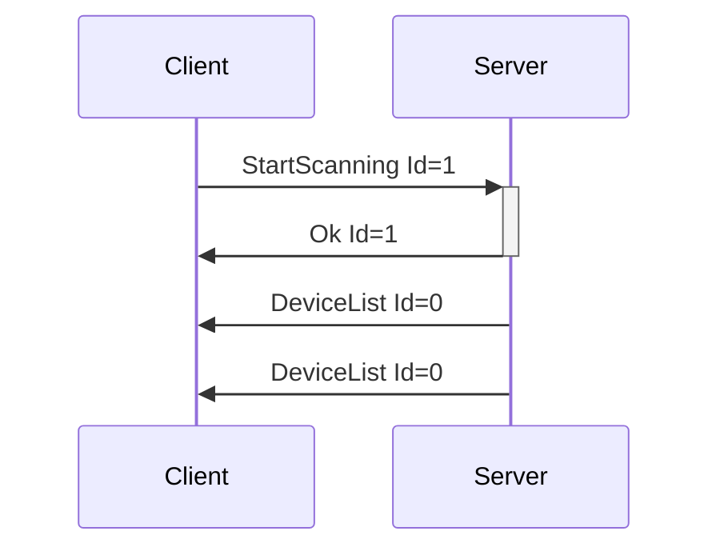
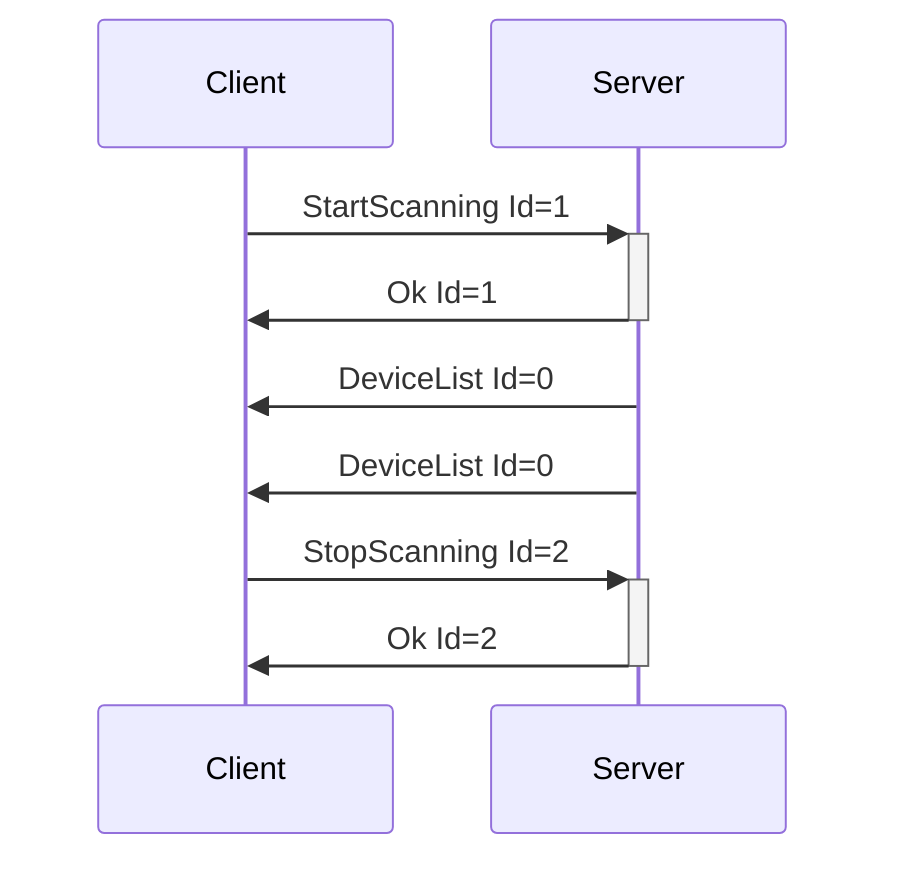
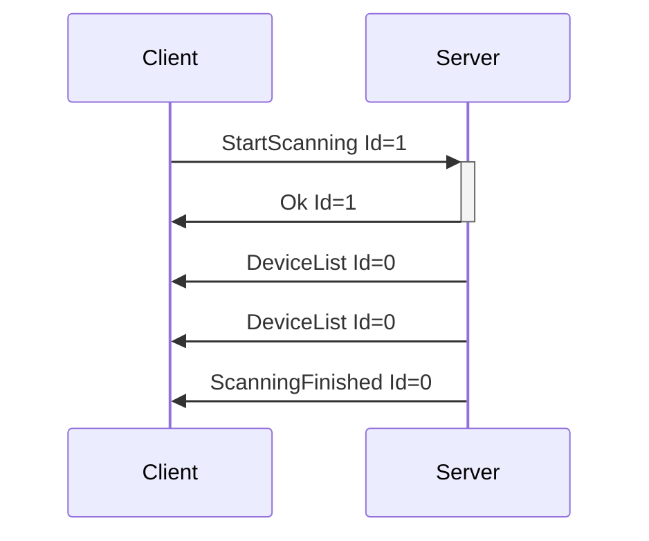
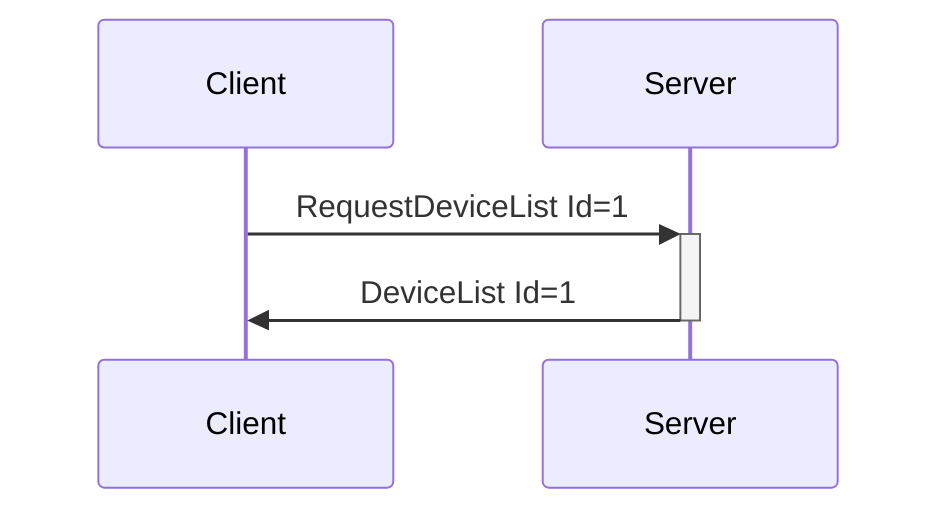

# Enumeration Messages

Messages relating to finding and getting information about devices connected to the system.

---
## StartScanning

**Description:** Client request to have the server start scanning for devices on all busses that it
knows about. Useful for protocols like Bluetooth, which require an explicit discovery phase.

**Introduced In Spec Version:** 0

**Last Updated In Spec Version:** 0

**Fields:**

* _Id_ (unsigned int): Message Id

**Expected Response:**

* Ok message with matching Id on successful request.
* Error message on value or message error.

**Flow Diagram:**



**Serialization Example:**

```json
[
  {
    "StartScanning": {
      "Id": 1
    }
  }
]
```
---
## StopScanning

**Description:** Client request to have the server stop scanning for devices. Useful for protocols
like Bluetooth, which may not timeout otherwise.

**Introduced In Spec Version:** 0

**Last Updated In Spec Version:** 0

**Fields:**

* _Id_ (unsigned int): Message Id

**Expected Response:**

* Ok message with matching Id on successful request.
* Error message on value or message error.

**Flow Diagram:**



**Serialization Example:**

```json
[
  {
    "StopScanning": {
      "Id": 1
    }
  }
]
```
---
## ScanningFinished

**Description:** Sent by the server once it has stopped scanning on all busses. Since systems may
have timeouts that are not controlled by the server, this is a separate message from the
StopScanning flow. ScanningFinished can happen without a StopScanning call.

In reality, this event is usually only useful when working with systems that can only scan for a single device at a time, like WebBluetooth. When on normal desktop/mobile APIs, it should be assumed that running StartScanning/StopScanning will be the main usage.

**Introduced In Spec Version:** 0

**Last Updated In Spec Version:** 0

**Fields:**

* _Id_ (unsigned int): Message Id

**Expected Response:**

None. Server-to-Client only.

**Flow Diagram:**



**Serialization Example:**

```json
[
  {
    "ScanningFinished": {
      "Id": 0
    }
  }
]
```
---
## RequestDeviceList

**Description:** Client request to have the server send over its known device list, without starting
a full scan.

**Introduced In Spec Version:** 0

**Last Updated In Spec Version:** 0

**Fields:**

* _Id_ (unsigned int): Message Id

**Expected Response:**

* DeviceList message with matching Id on successful request.
* Error message on value or message error.

**Flow Diagram:**



**Serialization Example:**

```json
[
  {
    "RequestDeviceList": {
      "Id": 1
    }
  }
]
```
---
## DeviceList

**Description:** Server reply to a client request for a device list.

**Introduced In Spec Version:** 0

**Last Updated In Spec Version:** 4 (See [Deprecated Messages](deprecated.md) for older versions.)

**Fields:**

* _Id_ (unsigned int): Message Id
* _Devices_ (array): Array of device objects
  * _DeviceName_ (string): Descriptive name of the device, as taken from the base device
    configuration file.
  * _DeviceIndex_ (unsigned integer): Index used to identify the device when sending Device
    Messages.
  * _DeviceMessageTimingGap_ (_optional_, unsigned integer): Recommended minimum gap between device
    commands, in milliseconds. This is only a recommendation, and will not be enforced on the
    server, as most times the server does not actually know the exact message gap timing required
    (hence this being recommended). Enforcement on the client (with developer option to disable) is
    encouraged. Optional field, not required to be included in message. Missing value should be
    assumed that server does not know recommended message gap.
  * _DeviceDisplayName_ (_optional_, string): User provided display name for a device. Useful for
    cases where a users may have multiple of the same device connected. Optional field, not required
    to be included in message. Missing value means that no device display name is set, and device
    name should be used.
  * _DeviceFeatures_ (array of feature objects, with each object having the following fields)
    * _Description_ (string): Text descriptor for a feature.
    * _FeatureIndex_ (unsigned 32-bit integer): Index that should be used to refer to the feature in
      messages like `ValueCmd`, `SensorReadCmd`, etc...
    * _FeatureType_ (string): The type of feature this descriptor represents. See [feature types]()
    * _Actuator_ (Object, may be null): Represents an actuator that is part of this feature
      * _Messages_ (array of strings): List of control message types that can be used by this feature.
      * _StepCount_ (unsigned 32-bit integer): Range of values that can be
        sent to control messages. For instance, if a vibrator has 20 steps of speed control,
        StepRange will be 20.
    * _Sensor_ (Object, may be null): Represents a sensor that may be part of this feature
      * _Messages_ (array of strings): List of control message types that can be used by this feature.
      * _ValueRange_ (Range, array of 2 signed 32-bit integer values): Range of values that may be
        received from the sensor.
    * _Raw_ (Object, may be null): If raw messages are turned on in the server, relays information
      needed to use them.
      * _Endpoints_ (array of strings): Array of endpoint names that can be used within raw
        messages.
    
**Expected Response:**

None. Server-to-Client message only.

**Flow Diagram:**


**Serialization Example:**

```json
[
  {
    "DeviceList": {
      "Id": 1,
      "Devices": [
        {
          "DeviceName": "Test Vibrator",
          "DeviceIndex": 0,
          "Features": [
            {
              "FeatureType": "Vibrate",
              "Descriptor": "Clitoral Stimulator",
              "Actuator": {
                "StepCount": 20,
                "Messages": ["ValueCmd"]
              }
            },
            {
              "FeatureType": "Vibrate",
              "Descriptor": "Insertable Stimulator",
              "Actuator": {
                "StepCount": 20,
                "Messages": ["ValueCmd"]
              }
            },
            {
              "FeatureType": "Battery",
              "Descriptor": "Battery",
              "Sensor": {
                "ValueRange": [0, 100],
                "Messages": ["SensorReadCmd"]
              }
            }
          ]
        },
        {
          "DeviceName": "Test Stroker",
          "DeviceIndex": 1,
          "DeviceMessageTimingGap": 100,
          "DeviceDisplayName": "User set name",
          "Features": [
            {
              "FeatureType": "PositionWithDuration",
              "Descriptor": "Stroker",
              "Actuator": {
                "StepCount": 100,
                "Messages": ["ValueWithParameterCmd"]
              }
            }
          ]
        }
      ]
    }
  }
]
```
