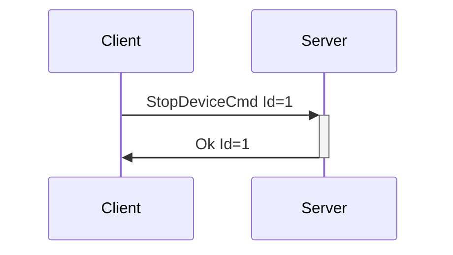
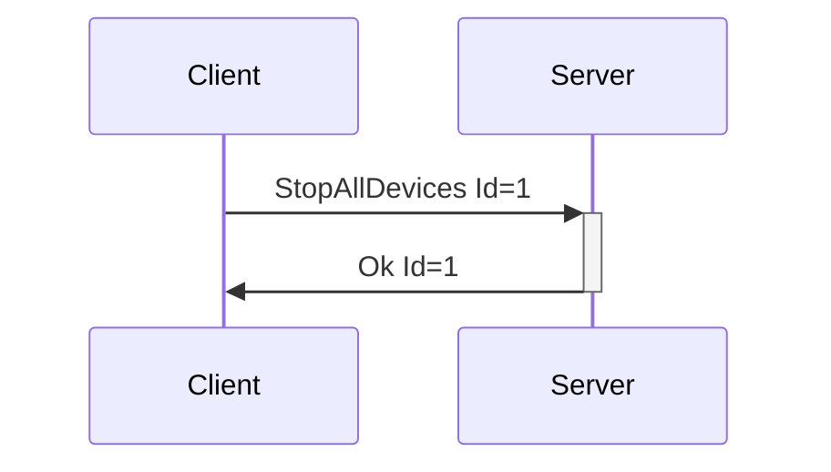
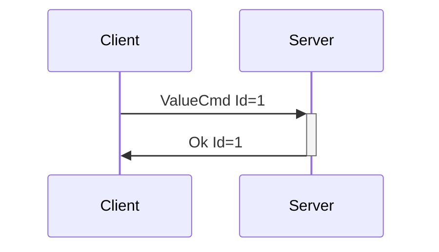
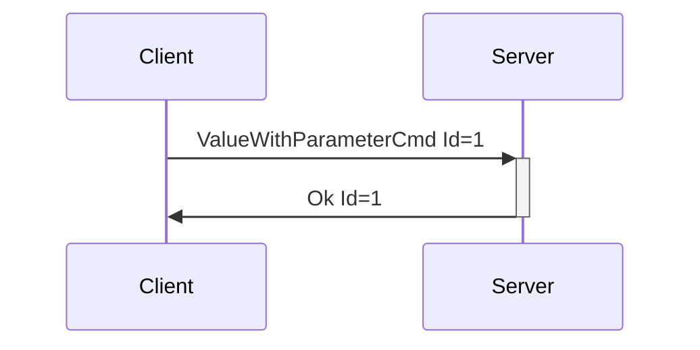

# Generic Device Messages

Generic device messages pertain to classes of devices, versus specific devices. For instance, the
generic ValueCmd with a FeatureType of Vibrate should be supported by all vibrating devices, and
StopDeviceCmd should be supported by all devices in order to stop them from whatever their current
action may be.

---
## StopDeviceCmd

**Description:** Client request to have the server stop a device from whatever actions it may be
taking. This message should be supported by all devices, and the server should know how to stop any
device it supports.

**Introduced In Spec Version:** 0

**Last Updated In Spec Version:** 0

**Fields:**

* _Id_ (unsigned int): Message Id
* _DeviceIndex_ (unsigned int): Index of device to stop.

**Expected Response:**

* Ok message with matching Id on successful request.
* Error message on value or message error.

**Flow Diagram:**



**Serialization Example:**

```json
[
  {
    "StopDeviceCmd": {
      "Id": 1,
      "DeviceIndex": 0
    }
  }
]
```
---
## StopAllDevices

**Description:** Sent by the client to tell the server to stop all devices. Can be used for
emergency situations, on client shutdown for cleanup, etc… While this is considered a Device
Message, since it pertains to all currently connected devices, it does not specify a device index
(and does not end with 'Cmd').

**Introduced In Spec Version:** 0

**Last Updated In Spec Version:** 0

**Fields:**

* _Id_ (unsigned int): Message Id

**Expected Response:**

* Ok message with matching Id on successful request.
* Error message on value or message error.

**Flow Diagram:**



**Serialization Example:**

```json
[
  {
    "StopAllDevices": {
      "Id": 1
    }
  }
]
```
---
## ValueCmd

**Description:** Sets the value for a feature. For instance, the vibration speed of a vibrator, the
oscillating speed of a non-position-based fucking machine, etc... The features portion of the
[DeviceList](enumeration.md#devicelist) message contains information on the actuator type and
description, number of actuators, level ranges, and more.

Due to the amount of different value contexts within haptics (vibration speed, oscillation speed,
inflate/constrict pressures, etc), this message provides flexibility to add new acutuation types
without having to introduce new messages into the protocol. The values accepted as actuator types
can be extended as needed.

In practice, ValueCmd is meants to be exposed to developers via crafted APIs, i.e. having
vibrate()/rotate()/oscillate() etc functions available on a data structure that represents a device
feature, with the actuator types denoting which of those methods may be allowed. The ValueCmd
itself can be exposed via API also, but this may lead to a lack of attention to context that could
cause issues (i.e. someone driving a vibrator and a fucking machine with the same power signals).
Mitigation for that type of issue may be UX related versus system/protocol related, by letting users
set speed limits and ranges for devices.

**Introduced In Spec Version:** 4

**Last Updated In Spec Version:** 4

**Fields:**

* _Id_ (unsigned int): Message Id
* _DeviceIndex_ (unsigned int): Index of device
* _FeatureIndex_ (unsigned int): Index of actuator
* _Value_ (unsigned int): Value to set, within the step range presented for the feature
* _ActuatorType_ (string): Type of actuator that the user expects to control with this command.
  This is to make sure that context is correct between the client and server.

**Expected Response:**

* Ok message with matching Id on successful request.
* Error message on value or message error.

**Flow Diagram:**



**Serialization Example:**

```json
[
  {
    "ValueCmd": {
      "Id": 1,
      "DeviceIndex": 0,
      "FeatureIndex": 0,
      "Value": 10,
      "ActuatorType": "Vibrate"
    }
  }
]
```
---
## ValueWithParameterCmd

**Description:** Sets the value for a feature, along with a supporting parameter in relation to that
value. For instance, setting a position for stroker to move to, a rotation speed with a direction,
etc.... The features portion of the [DeviceList](enumeration.md#devicelist) message contains
information on the actuator type and description, number of actuators, level ranges, and more.

Due to the amount of different value contexts within haptics (rotation, positional stroking, etc),
this message provides flexibility to add new acutuation types without having to introduce new
messages into the protocol. The values accepted as actuator types can be extended as needed.

In practice, ValueWithParameterCmd is meants to be exposed to developers via crafted APIs, i.e.
having position_with_duration()/rotation_with_direction()/etc functions available on a data
structure that represents a device feature, with the actuator types denoting which of those methods
may be allowed. The ValueWithParameterCmd itself can be exposed via API also, but this may lead to a
lack of attention to context that could cause issues (i.e. someone driving a rotating device and a
stroker with the same signals, even though the parameter types don't match). Mitigation for that
type of issue may be UX related versus system/protocol related, by letting users set speed limits
and ranges for devices.

**Introduced In Spec Version:** 4

**Last Updated In Spec Version:** 4

**Fields:**

* _Id_ (unsigned int): Message Id
* _DeviceIndex_ (unsigned 32-bit int): Index of device
* _FeatureIndex_ (unsigned 32-bit int): Index of actuator
* _Value_ (unsigned 32-bit int): Value to set, within the step range presented for the feature
* _Parameter_ (signed 32-bit int, based on ActuatorType): Parameter to use in relation to value,
  such as rotation direction or movement duration.
* _ActuatorType_ (string): Type of actuator that the user expects to control with this command.
  This is to make sure that context is correct between the client and server.

**Expected Response:**

* Ok message with matching Id on successful request.
* Error message on value or message error.

**Flow Diagram:**



**Serialization Example:**

```json
[
  {
    "ValueWithParameterCmd": {
      "Id": 1,
      "DeviceIndex": 0,
      "FeatureIndex": 0,
      "Value": 50,
      "Duration": 500,
      "ActuatorType": "PositionWithDuration"
    }
  }
]
```