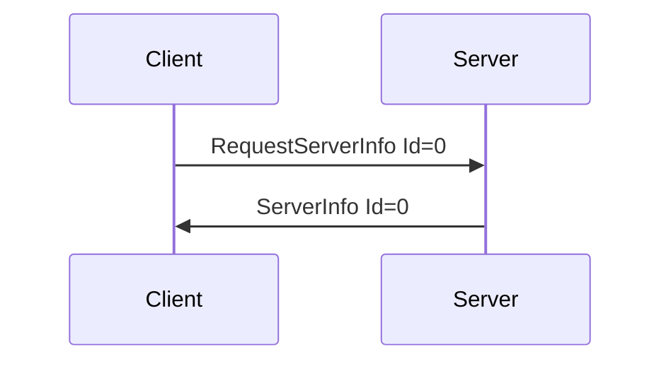

# Handshake Messages

Messages used in the client/server handshake procedure.

---
## RequestServerInfo

**Description:** Sent by the client to register itself with the server, and request info from the
server.

**Introduced In Spec Version:** 0

**Last Updated In Spec Version:** 4 (See [Deprecated
Messages](deprecated.md#requestserverinfo---spec-v1) for older versions.)

**Fields:**

* _Id_ \(unsigned int\): Message Id
* _ClientName_ \(string\): Name of the client, for the server to use for UI if needed. Cannot be
  null.
* _ProtocolVersionMajor_ \(uint\): Message spec major version of the client software.
* _ProtocolVersionMinor_ \(uint\): Message spec minor version of the client software.

**Expected Response:**

* ServerInfo message on success.
* Error message on malformed message, null client name, server not able to use requested message
  spec version, or other error.

**Flow Diagram:**



**Serialization Example:**

```json
[
  {
    "RequestServerInfo": {
      "Id": 1,
      "ClientName": "Test Client",
      "ProtocolVersionMajor": 4,
      "ProtocolVersionMinor": 0
    }
  }
]
```
---
## ServerInfo

**Description:** Send by server to client, contains information about the server name \(optional\) and ping time expectations.

**Introduced In Spec Version:** 0

**Last Updated In Spec Version:** 4

**Fields:**

* _Id_ \(unsigned int\): Message Id
* _ServerName_ \(string\): Name of the server. Can be null \(0-length, but field will still exist\).
* _MaxPingTime_ \(uint\): Maximum internal for pings from the client, in milliseconds. If a client
  takes to longer than this time between sending Ping messages, the server is expected to
  disconnect.
* _ProtocolVersionMajor_ \(uint\): Message spec major version of the client software.
* _ProtocolVersionMinor_ \(uint\): Message spec minor version of the client software.

**Expected Response:**

None. Server-To-Client message only.

**Flow Diagram:**


**Serialization Example:**

```json
[
  {
    "ServerInfo": {
      "Id": 1,
      "ServerName": "Test Server",
      "MaxPingTime": 100,
      "ProtocolVersionMajor": 4,
      "ProtocolVersionMinor": 0
    }
  }
]
```
