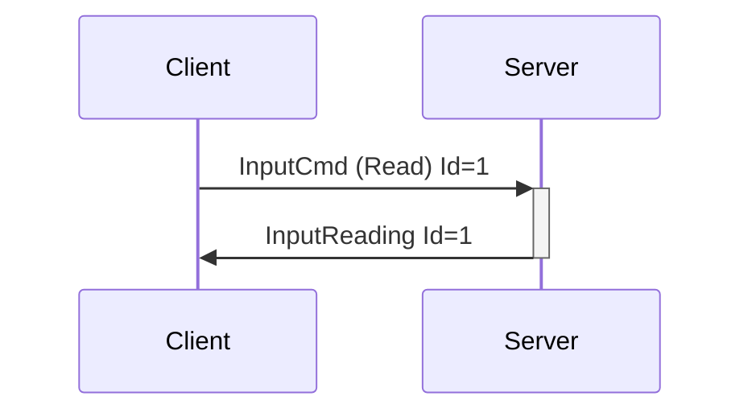

# InputCmd, InputReading, and InputType

Getting data from devices is done via InputCmd. Within this message we encode all possible input information, making it simple to add new functionality.

---

## InputCmd

**Description:** Sends a command to receive input of some type. For instance, the battery level of a
wireless device, pressure readings from a sensor, axes of an accelerometer, current motor positions,
etc... The features portion of the [DeviceList](enumeration.md#devicelist) or DeviceAdded message
contains information on the input type and description, ranges, and more.

Due to the amount of different sensor contexts within toys, the corresponding InputReading message
provides flexibility to add new input types without having to introduce new messages into the
protocol. The values accepted as input types can be extended as needed. Additions of these types
will be considered Minor Version bumps.

In practice, InputCmd is meants to be exposed to developers via crafted APIs, i.e. having
battery()/rssi()/subscribe(\[type\]) etc functions available on a data structure that represents a
device feature, with the input types denoting which of those methods may be allowed.

**Introduced In Spec Version:** 4

**Last Updated In Spec Version:** 4

**Fields:**

* _Id_ (unsigned int): Message Id
* _DeviceIndex_ (unsigned int): Index of device
* _FeatureIndex_ (unsigned int): Index of actuator
* _InputType_ (InputType): The type of input we expect to receive from this feature. Battery, RSSI,
  etc...
* _InputCommandType_ (InputCommandType): One of 3 values: `Read`, `Subscribe`, `Unsubscribe`. Which
  of these types are available to a feature is transmitted as part of the DeviceAdded/DeviceList info.

**Expected Response:**

* Read
  * InputReading with matching Id on successful request
* Subscribe/Unsubscribe
  * Ok message with matching Id on successful request
* Error message on value/message/device error.

**Flow Diagram:**



```mermaid
sequenceDiagram
    Client->>+Server: InputCmd (Subscribe) Id=1
    Server->>-Client: Ok Id=1
    Server->>-Client: InputReading Id=0
    Server->>-Client: InputReading Id=0
    Server->>-Client: InputReading Id=0
    Client->>+Server: InputCmd (Unsubscribe) Id=2
    Server->>-Client: Ok Id=2
```

**Serialization Example:**

```json
[
  {
    "InputCmd": {
      "Id": 1,
      "DeviceIndex": 0,
      "FeatureIndex": 1,
      "InputType": "Battery",
      "InputCommandType": "Read"
    }
  },
  {
    "OutputCmd": {
      "Id": 2,
      "DeviceIndex": 1,
      "FeatureIndex": 0,
      "InputType": "Pressure",
      "InputCommandType": "Subscribe"
    }
  }
]
```

---

## InputReading

**Description:** InputReading contains data received from a device input, either after a read request or as part of a stream of readings from a subscription. This can be anything from battery power levels, to motor encoder positions, to accelerometer readings. Expected dimensionality and format is set via the corresponding InputCmd definition in the DeviceAdded/DeviceList messages.

**Introduced In Spec Version:** 4

**Last Updated In Spec Version:** 4

**Fields:**

* _Id_ (unsigned int): Message Id
* _DeviceIndex_ (unsigned int): Index of device
* _FeatureIndex_ (unsigned int): Index of actuator
* _InputData_ (InputData): Data from the sensor, including InputType and the corresponding format. See InputType table below for more information on expected data types.

**Expected Response:**

* None, message is Server -> Client only

**Flow Diagram:**


```mermaid
sequenceDiagram
    Client->>+Server: InputCmd (Subscribe) Id=1
    Server->>-Client: Ok Id=1
    Server->>-Client: InputReading Id=0
    Server->>-Client: InputReading Id=0
    Server->>-Client: InputReading Id=0
    Client->>+Server: InputCmd (Unsubscribe) Id=2
    Server->>-Client: Ok Id=2
```

**Serialization Example:**

```json
[
  {
    "InputReading": {
      "Id": 1,
      "DeviceIndex": 0,
      "FeatureIndex": 1,
      "InputData": {
        "Battery": {
          "Level": 50
        }
      }
    }
  },
  {
    "InputReading": {
      "Id": 0,
      "DeviceIndex": 1,
      "FeatureIndex": 0,
      "InputData": {
        "Pressure": {
          "Level": 200
        }
      }
    }
  }
]
```

---

## InputType

InputType denotes data that a device should provide back to us, via some sort of sensor. It also corresponds to the format of the data we will receive in the InputReading message.

:::tip Possible Upcoming Input Types

While sensor input has been in Buttplug since the v2 spec in one way or another, it's never been built in an expandable way until now. We're keeping things low key for the first release as we figure out how this is going to work, but future input types may include:

- Accelerometer (1-axis and 3-axis)
- Gyro
- Temperature
- Depth/Distance
- If you have other ideas, let us know!

:::

### Battery

**Introduced In Spec Version:** 4

**Description**: Battery level for a device. A percentage between 0-100.

**Device Examples**: Anything with a battery we can read. A fair amount of bluetooth devices support this, as do XBox controllers.

**Fields**
- Level
  - **Type**: Unsigned 8-bit integer
  - **Description**: Percentage, will always be 0-100.

**Example**:
```json
  [{
    "InputReading": {
      "Id": 1,
      "DeviceIndex": 0,
      "FeatureIndex": 1,
      "InputData": {
        "Battery": {
          "Level": 50
        }
      }
    }
  }]
```

### RSSI

**Introduced In Spec Version:** 4

**Description**: RSSI level of a wireless radio device.

**Device Examples**: This is a feature of Bluetooth, rather than devices. Should technically work for any bluetooth device.

**Fields**
- Level
  - **Type**: Signed 8-bit integer
  - **Description**: Always a negative, usually somewhere between -10 and -100

**Example**:
```json
  [{
    "InputReading": {
      "Id": 1,
      "DeviceIndex": 0,
      "FeatureIndex": 1,
      "InputData": {
        "RSSI": {
          "Level": -53
        }
      }
    }
  }]
```

### Pressure

**Introduced In Spec Version:** 4

**Description**: Pressure level from a sensor

**Device Examples**: Usually a kegel sensor, like a Kgoal Boost, perifit, Edge-o-matic, etc... Units will differ greatly between devices and will require per-application calibration. See dev guide for more info.

**Fields**
- Level
  - **Type**: Unsigned 32-bit integer
  - **Description**: Pressure level of the sensor. We don't have a standard unit for this, so it
    will vary from product to product. See dev guide for more info.

**Example**:
```json
  [{
    "InputReading": {
      "Id": 0,
      "DeviceIndex": 0,
      "FeatureIndex": 1,
      "Pressure": {
        "Pressure": {
          "Level": 1252
        }
      }
    }
  }]
```

### Button

**Introduced In Spec Version:** 4

**Description**: A digital button on a device.

**Device Examples**: Any device that has buttons we can read. For instance, the Kiiroo Keon has readable buttons. This is NOT MEANT TO BE USED FOR ANYTHING ACCESSIBLE VIA HID, please use HID libraries for that. Please don't route your gamepad through buttplug unless your gamepad also goes on/in genetalia or butts.

**Fields**
- Level
  - **Type**: Unsigned 8-bit integer
  - **Description**: 1 for down, 0 for up

**Example**:
```json
  [{
    "InputReading": {
      "Id": 0,
      "DeviceIndex": 0,
      "FeatureIndex": 4,
      "InputData": {
        "Button": {
          "Level": 1
        }
      }
    }
  }]
```