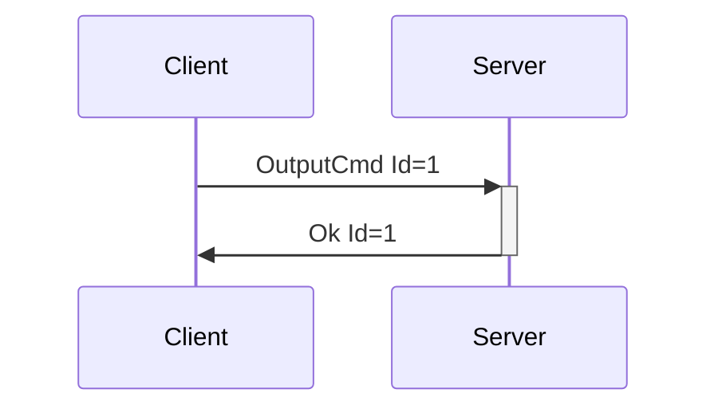

# OutputCmd and OutputType

Controlling devices is done via OutputCmd. Within this message we encode all possible output information, making it simple to add new functionality.

---

## OutputCmd

**Description:** Sends a command to an output of some type. For instance, the vibration speed of a
vibrator, the oscillating speed of a non-position-based fucking machine, positions with durations to
strokers, etc... The features portion of the [DeviceList](enumeration.md#devicelist) or DeviceAdded
message contains information on the actuator type and description, number of actuators, level
ranges, and more.

Due to the amount of different value contexts within haptics (vibration speed, oscillation speed,
inflate/constrict pressures, etc), this message provides flexibility to add new acutuation types
without having to introduce new messages into the protocol. The values accepted as output types
can be extended as needed. Additions of these types will be considered Minor Version bumps.

In practice, OutputCmd is meants to be exposed to developers via crafted APIs, i.e. having
vibrate()/rotate()/oscillate() etc functions available on a data structure that represents a device
feature, with the output types denoting which of those methods may be allowed. OutputCmd
itself can be exposed via API also, but this may lead to a lack of attention to context that could
cause issues (i.e. someone driving a vibrator and a fucking machine with the same power signals).
Mitigation for that type of issue may be UX related versus system/protocol related, by letting users
set speed limits and ranges for devices.

**Introduced In Spec Version:** 4

**Last Updated In Spec Version:** 4

**Fields:**

* _Id_ (unsigned int): Message Id
* _DeviceIndex_ (unsigned int): Index of device
* _FeatureIndex_ (unsigned int): Index of actuator
* _Command_ (OutputCommand): An object representing the output command. This denotes both the
  context of the command as well as the value.

**Expected Response:**

* Ok message with matching Id on successful request.
* Error message on value/message/device error.

**Flow Diagram:**



**Serialization Example:**

```json
[
  {
    "OutputCmd": {
      "Id": 1,
      "DeviceIndex": 0,
      "FeatureIndex": 0,
      "Command": {
        "Vibrate": {
          "Value": 10
        }
      }
    }
  },
  {
    "OutputCmd": {
      "Id": 2,
      "DeviceIndex": 1,
      "FeatureIndex": 0,
      "Command": {
        "PositionWithDuration": {
          "Position": 91,
          "Duration": 150
        }
      }
    }
  }
]
```

---

## OutputType

OutputType denotes a thing that a device feature does to a user. Think of it like a verb, possibly with an added bit of context. 

### Vibrate

**Introduced In Spec Version:** 4

**Description**: Sets a vibrator speed to a certain amount. 0 always denotes stop, otherwise valid speeds are between 0 and the StepCount value. 

**Fields**
- Value
  - **Type**: Unsigned 32-bit integer
  - **Description**: Vibrator speed, valid settings are within 0 < x < StepCount 

**Example**:
```json
  [{
    "OutputCmd": {
      "Id": 1,
      "DeviceIndex": 0,
      "FeatureIndex": 0,
      "Command": {
        "Vibrate": {
          "Value": 10
        }
      }
    }
  }]
```

### Rotate

**Introduced In Spec Version:** 4

**Description**: Sets a rotator speed to a certain amount. It is assumed we cannot control the direction of the rotation for this feature. 0 always denotes stop, otherwise valid speeds are between 0 and the StepCount value.

**Fields**
- Value
  - **Type**: Unsigned 32-bit integer
  - **Description**: Vibrator speed, valid settings are within 0 < x < StepCount 

**Example**:
```json
  [{
    "OutputCmd": {
      "Id": 1,
      "DeviceIndex": 0,
      "FeatureIndex": 0,
      "Command": {
        "Rotate": {
          "Value": 10
        }
      }
    }
  }]
```

### RotationWithDirection

**Introduced In Spec Version:** 4

**Description**: Sets a rotator speed to a certain amount, along with its direction. This resembles [RotateCmd](deprecated.md#rotatecmd) from earlier spec versions. 0 always denotes stop, otherwise valid speeds are between 0 and the StepCount value.

**Fields**
- Value
  - **Type**: Unsigned 32-bit integer
  - **Description**: Vibrator speed, valid settings are within 0 < x < StepCount 
- Clockwise
  - **Type**: Boolean
  - **Description**: If true, rotate in a clockwise direction. Otherwise, rotate in a
    counterclockwise direction.  

**Example**:
```json
  [{
    "OutputCmd": {
      "Id": 1,
      "DeviceIndex": 0,
      "FeatureIndex": 0,
      "Command": {
        "RotateWithDirection": {
          "Value": 10,
          "Clockwise": false
        }
      }
    }
  }]
```

### Oscillate

**Introduced In Spec Version:** 4

**Description**: Sets an oscillator speed to a certain amount. It is assumed we cannot control the start/end oscillation points for this feature, and that we are just controlling the speed between those two points. 0 always denotes stop, otherwise valid speeds are between 0 and the StepCount value.

**Fields**
- Value
  - **Type**: Unsigned 32-bit integer
  - **Description**: Oscillation speed, valid settings are within 0 < x < StepCount 

**Example**:
```json
  [{
    "OutputCmd": {
      "Id": 1,
      "DeviceIndex": 0,
      "FeatureIndex": 0,
      "Command": {
        "Oscillate": {
          "Value": 10
        }
      }
    }
  }]
```

### Constrict

**Introduced In Spec Version:** 4

**Description**: Sets an oscillator speed to a certain amount. It is assumed we cannot control the start/end oscillation points for this feature, and that we are just controlling the speed between those two points. 0 always denotes stop, otherwise valid speeds are between 0 and the StepCount value.

**Fields**
- Value
  - **Type**: Unsigned 32-bit integer
  - **Description**: Oscillation speed, valid settings are within 0 < x < StepCount 

**Example**:
```json
  [{
    "OutputCmd": {
      "Id": 1,
      "DeviceIndex": 0,
      "FeatureIndex": 0,
      "Command": {
        "Constrict": {
          "Value": 10
        }
      }
    }
  }]
```

### Inflate

**Introduced In Spec Version:** 4

### Heater

**Introduced In Spec Version:** 4

**Description**: Sets the heat level for a device with a heating element. It will be vanishingly rare that we have information about the exact temperature that we can set the heater to, so this will normally be some number of "heating steps". 0 always denotes turning off the heater, otherwise valid commands are between 0 and the StepCount value.

**Fields**
- Value
  - **Type**: Unsigned 32-bit integer
  - **Description**: Oscillation speed, valid settings are within 0 < x < StepCount 

**Example**:
```json
  [{
    "OutputCmd": {
      "Id": 1,
      "DeviceIndex": 0,
      "FeatureIndex": 0,
      "Command": {
        "Inflate": {
          "Value": 10
        }
      }
    }
  }]
```

### LED (Encoded as Led)

**Introduced In Spec Version:** 4

**Description**: Sets the brightness value of an LED. If StepCount = 1, can be considered to simply be an off/on switch. Different color LED control (for RGB devices) will show up as multiple LED features, with color in the feature description. 0 always denotes turning off the LED, otherwise valid commands are between 0 and the StepCount value. This is encoded as _Led_ to handle the way most implementation languages expect class casing.

**Fields**
- Value
  - **Type**: Unsigned 32-bit integer
  - **Description**: Brightness, valid settings are within 0 < x < StepCount 

**Example**:
```json
  [{
    "OutputCmd": {
      "Id": 1,
      "DeviceIndex": 0,
      "FeatureIndex": 0,
      "Command": {
        "Led": {
          "Value": 10
        }
      }
    }
  }]
```

### Position

**Introduced In Spec Version:** 4

### PositionWithDuration

**Introduced In Spec Version:** 4
