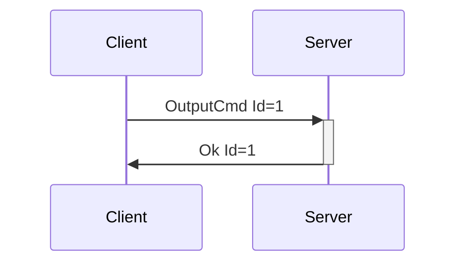

# OutputCmd and OutputType

---

## OutputType

### OutputType Table

## OutputCmd

**Description:** Sends a command to an output of some type. For instance, the vibration speed of a
vibrator, the oscillating speed of a non-position-based fucking machine, positions with durations to
strokers, etc... The features portion of the [DeviceList](enumeration.md#devicelist) or DeviceAdded
message contains information on the actuator type and description, number of actuators, level
ranges, and more.

Due to the amount of different value contexts within haptics (vibration speed, oscillation speed,
inflate/constrict pressures, etc), this message provides flexibility to add new acutuation types
without having to introduce new messages into the protocol. The values accepted as output types
can be extended as needed. Additions of these types will be considered Minor Version bumps.

In practice, OutputCmd is meants to be exposed to developers via crafted APIs, i.e. having
vibrate()/rotate()/oscillate() etc functions available on a data structure that represents a device
feature, with the output types denoting which of those methods may be allowed. OutputCmd
itself can be exposed via API also, but this may lead to a lack of attention to context that could
cause issues (i.e. someone driving a vibrator and a fucking machine with the same power signals).
Mitigation for that type of issue may be UX related versus system/protocol related, by letting users
set speed limits and ranges for devices.

**Introduced In Spec Version:** 4

**Last Updated In Spec Version:** 4

**Fields:**

* _Id_ (unsigned int): Message Id
* _DeviceIndex_ (unsigned int): Index of device
* _FeatureIndex_ (unsigned int): Index of actuator
* _Command_ (OutputCommand): An object representing the output command. This denotes both the
  context of the command as well as the value.

**Expected Response:**

* Ok message with matching Id on successful request.
* Error message on value/message/device error.

**Flow Diagram:**



**Serialization Example:**

```json
[
  {
    "OutputCmd": {
      "Id": 1,
      "DeviceIndex": 0,
      "FeatureIndex": 0,
      "Command": {
        "Vibrate": {
          "Value": 10
        }
      }
    }
  },
  {
    "OutputCmd": {
      "Id": 2,
      "DeviceIndex": 1,
      "FeatureIndex": 0,
      "Command": {
        "PositionWithDuration": {
          "Position": 91,
          "Duration": 150
        }
      }
    }
  }
]
```
