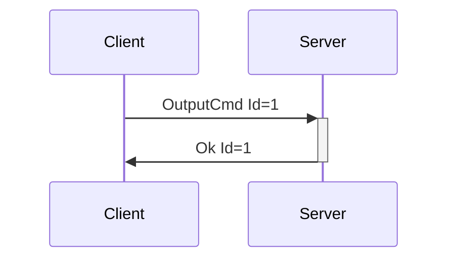

# OutputCmd and OutputType

Controlling devices is done via OutputCmd. Within this message we encode all possible output information, making it simple to add new functionality.

---

## OutputCmd

**Description:** Sends a command to an output of some type. For instance, the vibration speed of a
vibrator, the oscillating speed of a non-position-based fucking machine, positions with durations to
strokers, etc... The features portion of the [DeviceList](device_information.md#devicelist) message contains information on the actuator type and description, number of actuators,
level ranges, and more.

Due to the amount of different value contexts within haptics (vibration speed, oscillation speed,
inflate/constrict pressures, etc), this message provides flexibility to add new acutuation types
without having to introduce new messages into the protocol. The values accepted as output types
can be extended as needed. Additions of these types will be considered Minor Version bumps.

In practice, OutputCmd is meants to be exposed to developers via crafted APIs, i.e. having
vibrate()/rotate()/oscillate() etc functions available on a data structure that represents a device
feature, with the output types denoting which of those methods may be allowed. OutputCmd
itself can be exposed via API also, but this may lead to a lack of attention to context that could
cause issues (i.e. someone driving a vibrator and a fucking machine with the same power signals).
Mitigation for that type of issue may be UX related versus system/protocol related, by letting users
set speed limits and ranges for devices.

:::tip What happened to Subcommands?

In Buttplug Spec v1-v3, our generic commands took multiple "subcommands", allowing developers to send updates to multiple features in the same message, possibly for update at the same time.

Building APIs for messages in this format was a nightmare, so the feature was either ignored or turned libraries into a complete mess of multiple call types per output type (depending on if all features should be set to the same value, or different values, etc...). Also, developers were never actually aware if devices _needed_ multiple features updated at the same time, or if they'd send one message per device update. This information is in the protocol, which is hidden from the Client level. Subcommands added complexity without any benefit.

As of v4, we move to 1 command per message. This will now require extra logic in the server, in order to bundle commands that come in quick succession if a protocol allows it so we can reduce messages. The removed complexity for client/app developers easily provides return on investment for the added server side logic though.

:::


**Introduced In Spec Version:** 4

**Last Updated In Spec Version:** 4

**Fields:**

* _Id_ (unsigned int): Message Id
* _DeviceIndex_ (unsigned int): Index of device
* _FeatureIndex_ (unsigned int): Index of actuator
* _Command_ (OutputCommand): An object representing the output command. This denotes both the
  context of the command as well as the value.

**Expected Response:**

* Ok message with matching Id on successful request.
* Error message on value/message/device error.

**Flow Diagram:**



**Serialization Example:**

```json
[
  {
    "OutputCmd": {
      "Id": 1,
      "DeviceIndex": 0,
      "FeatureIndex": 0,
      "Command": {
        "Vibrate": {
          "Value": 10
        }
      }
    }
  },
  {
    "OutputCmd": {
      "Id": 2,
      "DeviceIndex": 1,
      "FeatureIndex": 0,
      "Command": {
        "PositionWithDuration": {
          "Position": 91,
          "Duration": 150
        }
      }
    }
  }
]
```

---

## OutputType

OutputType denotes a thing that a device feature does to a user. Think of it like a verb, possibly with an added bit of context. 

### Vibrate

**Introduced In Spec Version:** 4

**Description**: Sets a vibrator speed to a certain amount. 0 always denotes stop, otherwise valid speeds are between 0 and the StepCount value. 

**Device Examples**: It's... vibrators. Just vibrators. If you're using this library you are probably familiar with Vibrators. Buttplug's device support is probably 90% vibrators, so this will be used more than any other OutputType. The one thing to note here is that this is mostly assuming Off-axis/Eccentric Rotation Motor (ERM) vibrators. LRA/Voice Coil based vibrating sex toys do exist, but are rare, and can still usually be controlled with this command.

**Fields**
- Value
  - **Type**: Unsigned 32-bit integer
  - **Description**: Vibrator speed, valid settings are within 0 < x < StepCount 

**Example**:
```json
  [{
    "OutputCmd": {
      "Id": 1,
      "DeviceIndex": 0,
      "FeatureIndex": 0,
      "Command": {
        "Vibrate": {
          "Value": 10
        }
      }
    }
  }]
```

### Rotate

**Introduced In Spec Version:** 4

**Description**: Sets a rotator speed to a certain amount. It is assumed we cannot control the direction of the rotation for this feature. 0 always denotes stop, otherwise valid speeds are between 0 and the StepCount value.

**Device Examples**: Any RotationWithDirection capable device, Lovense Flexer, several Joyhub devices

**Fields**
- Value
  - **Type**: Unsigned 32-bit integer
  - **Description**: Vibrator speed, valid settings are within 0 < x < StepCount 

**Example**:
```json
  [{
    "OutputCmd": {
      "Id": 1,
      "DeviceIndex": 0,
      "FeatureIndex": 0,
      "Command": {
        "Rotate": {
          "Value": 10
        }
      }
    }
  }]
```

### RotationWithDirection

**Introduced In Spec Version:** 4

**Description**: Sets a rotator speed to a certain amount, along with its direction. This resembles [RotateCmd](deprecated.md#rotatecmd) from earlier spec versions. 0 always denotes stop, otherwise valid speeds are between 0 and the StepCount value. Note that RotationWithDirection features usually support the simpler Rotate command as a fallback.

**Device Examples**: Lovense Nora, Motorbunny Classic, Nexus Revo, Vorze UFO SA, Cyclone SA,

**Fields**
- Value
  - **Type**: Unsigned 32-bit integer
  - **Description**: Vibrator speed, valid settings are within 0 < x < StepCount 
- Clockwise
  - **Type**: Boolean
  - **Description**: If true, rotate in a clockwise direction. Otherwise, rotate in a
    counterclockwise direction.  

**Example**:
```json
  [{
    "OutputCmd": {
      "Id": 1,
      "DeviceIndex": 0,
      "FeatureIndex": 0,
      "Command": {
        "RotateWithDirection": {
          "Value": 10,
          "Clockwise": false
        }
      }
    }
  }]
```

### Oscillate

**Introduced In Spec Version:** 4

**Description**: Sets an oscillator speed to a certain amount. It is assumed we cannot control the start/end oscillation points for this feature, and that we are just controlling the speed between those two points. 0 always denotes stop, otherwise valid speeds are between 0 and the StepCount value.

**Device Examples**: Hismith Fucking Machines, Lovense Fucking Machine, Lovense Gravity, etc...

**Fields**
- Value
  - **Type**: Unsigned 32-bit integer
  - **Description**: Oscillation speed, valid settings are within 0 < x < StepCount 

**Example**:
```json
  [{
    "OutputCmd": {
      "Id": 1,
      "DeviceIndex": 0,
      "FeatureIndex": 0,
      "Command": {
        "Oscillate": {
          "Value": 10
        }
      }
    }
  }]
```

### Constrict

**Introduced In Spec Version:** 4

**Description**: Used for pumps and squeezing devices. Usually sets a constriction to a level, though whether or not that level is held until next setting can vary per device. 0 always denotes full release, otherwise valid levels are between 0 and the StepCount value.

**Device Examples**: Lovense Max, Svakom Sam Neo 2

**Fields**
- Value
  - **Type**: Unsigned 32-bit integer
  - **Description**: Oscillation speed, valid settings are within 0 < x < StepCount 

**Example**:
```json
  [{
    "OutputCmd": {
      "Id": 1,
      "DeviceIndex": 0,
      "FeatureIndex": 0,
      "Command": {
        "Constrict": {
          "Value": 10
        }
      }
    }
  }]
```

### Heater

**Introduced In Spec Version:** 4

**Description**: Sets the heat level for a device with a heating element. It will be vanishingly rare that we have information about the exact temperature that we can set the heater to, so this will normally be some number of "heating steps". 0 always denotes turning off the heater, otherwise valid commands are between 0 and the StepCount value.

**Device Examples**: N/A

**Fields**
- Value
  - **Type**: Unsigned 32-bit integer
  - **Description**: Oscillation speed, valid settings are within 0 < x < StepCount 

**Example**:
```json
  [{
    "OutputCmd": {
      "Id": 1,
      "DeviceIndex": 0,
      "FeatureIndex": 0,
      "Command": {
        "Heater": {
          "Value": 2
        }
      }
    }
  }]
```

### LED (Encoded as Led)

**Introduced In Spec Version:** 4

**Description**: Sets the brightness value of an LED. If StepCount = 1, can be considered to simply be an off/on switch. Different color LED control (for RGB devices) will show up as multiple LED features, with color in the feature description. 0 always denotes turning off the LED, otherwise valid commands are between 0 and the StepCount value. This is encoded as _Led_ to handle the way most implementation languages expect class casing.

:::tip Why is this Led and not LED?

Because a LOT of programming languages hate multiple capital letters next to each other in container names, so we just call it Led. Remember, this is just the line protocol, you can call it whatever you want in your client API methods.

:::

**Device Examples**: Lovense Domi

**Fields**
- Value
  - **Type**: Unsigned 32-bit integer
  - **Description**: Brightness, valid settings are within 0 < x < StepCount 

**Example**:
```json
  [{
    "OutputCmd": {
      "Id": 1,
      "DeviceIndex": 0,
      "FeatureIndex": 0,
      "Command": {
        "Led": {
          "Value": 10
        }
      }
    }
  }]
```

### Position

**Introduced In Spec Version:** 4

**Description**: Command device to move to a certain position as quickly as possible, aka servoing. Should only be used for very small movements at a time, and in most cases is expected to run at a maximum update rate for the device. There is no _Stop_ handling for a position movement, as it is expected to move then stop quickly.

**Device Examples**: Various axes of the OSR-2/SR-6/SR-1 systems, including the stroker as well as twist/pressure cap/etc mechanisms, possibly other strokers like the Kiiroo Keon or Lovense Solace Pro but with less accuracy than wired devices. Not sure if there's a way to do this with The Handy.

**Fields**
- Position
  - **Type**: Unsigned 32-bit integer
  - **Description**: Position to servo to, valid settings are within 0 < x < StepCount 

**Example**:
```json
  [{
    "OutputCmd": {
      "Id": 1,
      "DeviceIndex": 0,
      "FeatureIndex": 0,
      "Command": {
        "Position": {
          "Value": 10
        }
      }
    }
  }]
```

### PositionWithDuration

**Introduced In Spec Version:** 4

**Description**: Command device to move to a certain position as quickly as possible, aka servoing. Should only be used for very small movements at a time, and in most cases is expected to run at a maximum update rate for the device. There is no _Stop_ handling for a position movement, as it is expected to move then stop quickly.

**Device Examples**: Various axes of the OSR-2/SR-6/SR-1 systems, including the stroker as well as twist/pressure cap/etc mechanisms, other strokers like the Kiiroo Keon, Lovense Solace Pro, or The Handy.

**Fields**
- Position
  - **Type**: Unsigned 32-bit integer
  - **Description**: Position to move to over \[duration\] time, valid settings are within 0 < x < StepCount 
- Duration
  - **Type**: Unsigned 32-bit integer
  - **Description**: Duration in milliseconds for move to new goal position

**Example**:
```json
  [{
    "OutputCmd": {
      "Id": 1,
      "DeviceIndex": 0,
      "FeatureIndex": 0,
      "Command": {
        "PositionWithDuration": {
          "Position": 85,
          "Duration": 15
        }
      }
    }
  }]
```