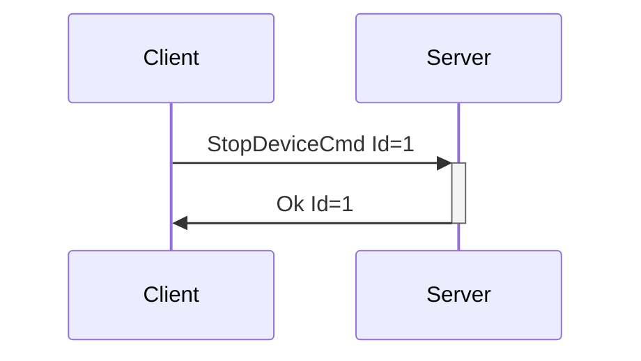
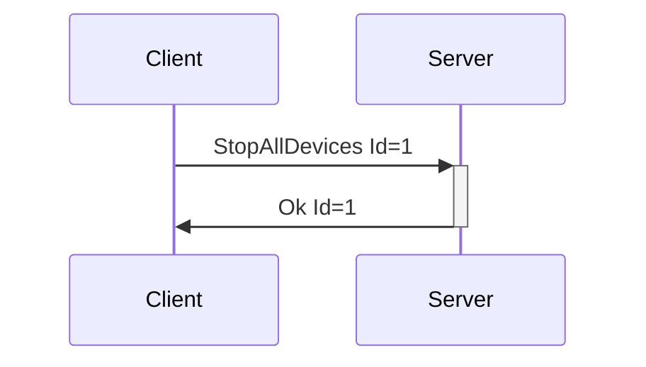

# Stop Device Messages

Possibly the most important messages in the system, Stop Device Messages stop connected devices from doing whatever they are currently doing. **All devices support StopDeviceCmd, and this message is not included in device capabilities lists in DeviceAdded/DeviceList.**

---
## StopDeviceCmd

**Description:** Client request to have the server stop a device from whatever actions it may be
taking. This message should be supported by all devices, and the server should know how to stop any
device it supports.

**Introduced In Spec Version:** 0

**Last Updated In Spec Version:** 0

**Fields:**

* _Id_ (unsigned int): Message Id
* _DeviceIndex_ (unsigned int): Index of device to stop.

**Expected Response:**

* Ok message with matching Id on successful request.
* Error message on value or message error.

**Flow Diagram:**



**Serialization Example:**

```json
[
  {
    "StopDeviceCmd": {
      "Id": 1,
      "DeviceIndex": 0
    }
  }
]
```
---
## StopAllDevices

**Description:** Sent by the client to tell the server to stop all devices. Can be used for
emergency situations, on client shutdown for cleanup, etc… While this is considered a Device
Message, since it pertains to all currently connected devices, it does not specify a device index
(and does not end with 'Cmd'). While it is polite to do so, the client is not _required_ to send StopAllDevices on disconnect. The server will normally stop devices on disconnect no matter what.

**Introduced In Spec Version:** 0

**Last Updated In Spec Version:** 0

**Fields:**

* _Id_ (unsigned int): Message Id

**Expected Response:**

* Ok message with matching Id on successful request.
* Error message on value or message error.

**Flow Diagram:**



**Serialization Example:**

```json
[
  {
    "StopAllDevices": {
      "Id": 1
    }
  }
]
```
---