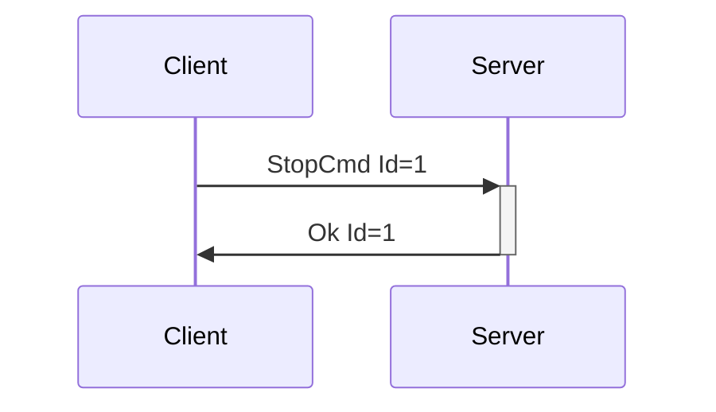

# Stop Device Messages

Possibly the most important messages in the system, Stop Device Messages stop
connected devices from doing whatever they are currently doing. **All devices
support StopDeviceCmd, and this message is not included in device capabilities
lists in DeviceAdded/DeviceList.**

---
## StopCmd

**Description:** Client request to have the server stop all devices, a device, or a feature on a
device from whatever actions it may be taking. This message should be supported by all devices, and
the server should know how to stop any device or feature it supports. Optional index fields allow
for stopping all features or devices.

**Introduced In Spec Version:** 4

**Last Updated In Spec Version:** 4

**Fields:**

* _Id_ (unsigned int): Message Id
* _DeviceIndex_ (unsigned int, optional): Index of device to stop. If not included, all devices are
  stopped.
* _FeatureIndex_ (unsigned int, optional): Index of the feature on the device to stop, assuming as
  device index is specified. If no device index is specified, feature index is ignored (as it does not make sense to stop "all features of index 1 across all devices")
* _Inputs_ (boolean, optional, default true): If true, unsubscribe subscribed inputs based on index
  selection.
* _Outputs_ (boolean, optional, default true): If true, stop outputs based on index selection.

**Expected Response:**

* Ok message with matching Id on successful request.
* Error message on value or message error.

**Flow Diagram:**



**Serialization Example:**

```json
[
  {
    "StopCmd": {
      "Id": 1,
      "DeviceIndex": 0,
      "FeatureIndex": 3,
      "Inputs": true,
      "Outputs": true
    }
  }
]
```

```json
[
  {
    "StopCmd": {
      "Id": 1,
      "Inputs": true,
      "Outputs": true
    }
  }
]
```